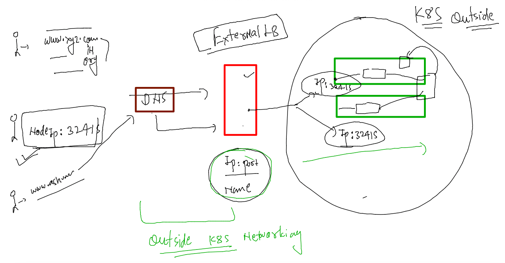
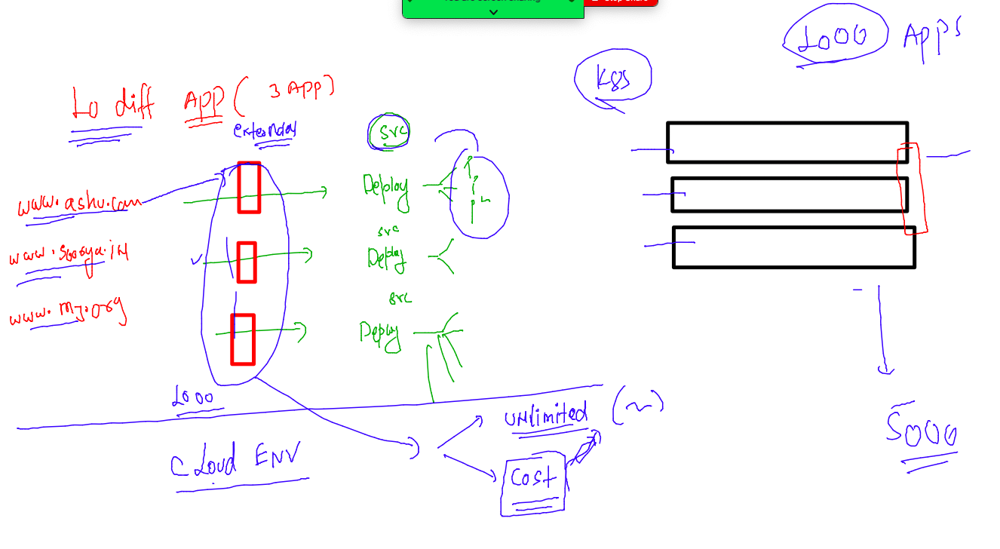
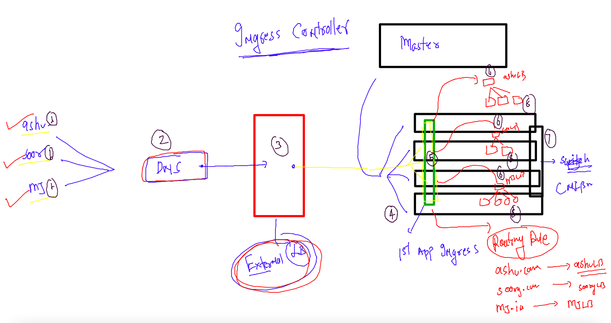
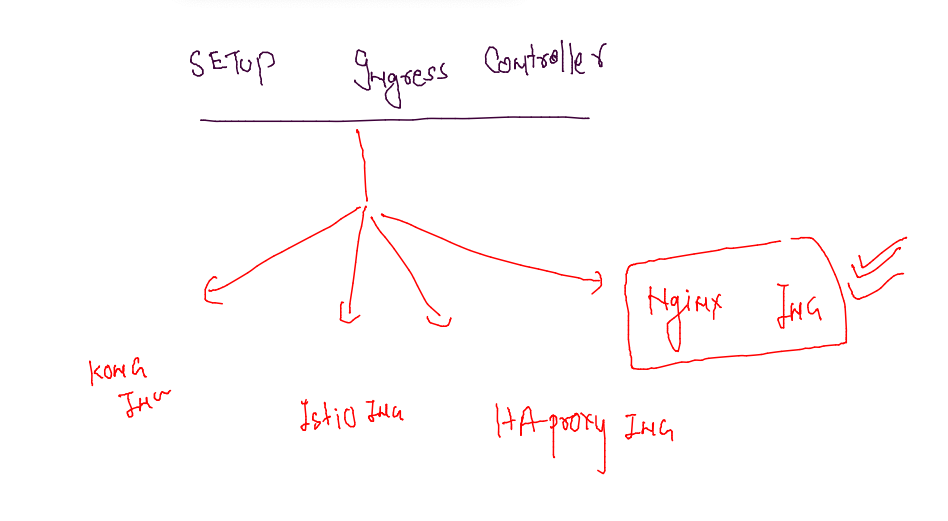
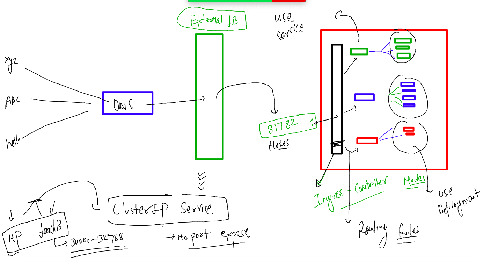
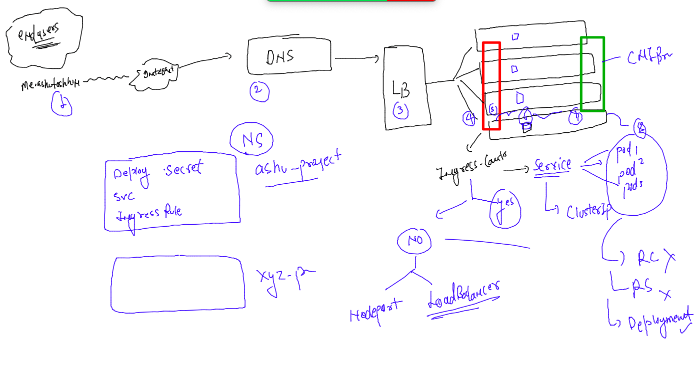

## Docker & K8s Training Plan 


### creating deployment 

```
fire@ashutoshhs-MacBook-Air k8s-app-deploy % kubectl create  deployment  ashu-dep1 --image=dockerashu/ashuapp:v001  --port 80 --dry-run=client -o yaml >deploy.yaml 
fire@ashutoshhs-MacBook-Air k8s-app-deploy % ls
deploy.yaml
fire@ashutoshhs-MacBook-Air k8s-app-deploy % kubectl apply -f deploy.yaml 
deployment.apps/ashu-dep1 created
fire@ashutoshhs-MacBook-Air k8s-app-deploy % kubectl get  deploy 
NAME        READY   UP-TO-DATE   AVAILABLE   AGE
ashu-dep1   1/1     1            1           20s
```

### creating service 

```
fire@ashutoshhs-MacBook-Air k8s-app-deploy % kubectl expose deployment  ashu-dep1 --type NodePort --port 8
0 --name ashulb2 --dry-run=client -o yaml >np.yaml 
fire@ashutoshhs-MacBook-Air k8s-app-deploy % ls
deploy.yaml     np.yaml
fire@ashutoshhs-MacBook-Air k8s-app-deploy % kubectl apply -f np.yaml 
service/ashulb2 created
fire@ashutoshhs-MacBook-Air k8s-app-deploy % kubectl get svc 
NAME      TYPE       CLUSTER-IP    EXTERNAL-IP   PORT(S)        AGE
ashulb2   NodePort   10.98.71.31   <none>        80:31285/TCP   6s
fire@ashutoshhs-MacBook-Air k8s-app-deploy % 
```

### creating externla LB 



### creating Loadbalancer & NodepOrt service 

```
 kubectl expose deployment ashu-dep1  --type LoadBalancer --port 80 --name ashulb999       --dry-run=client -o yaml >loadbalancer.yaml
fire@ashutoshhs-MacBook-Air k8s-app-deploy % 
fire@ashutoshhs-MacBook-Air k8s-app-deploy % kubectl  get  svc 
NAME        TYPE           CLUSTER-IP     EXTERNAL-IP   PORT(S)        AGE
ashulb2     NodePort       10.98.71.31    <none>        80:31285/TCP   52m
ashulb999   LoadBalancer   10.96.154.10   <pending>     80:30038/TCP   41s
fire@ashutoshhs-MacBook-Air k8s-app-deploy % 

```

### problem in Having app loadbalancer -- in case of multi app hosting 



### Ingress controller usage in k8s 



### options in INgress controller 



### setup Ingress controller -- 

```
fire@ashutoshhs-MacBook-Air Desktop % kubectl apply -f https://raw.githubusercontent.com/kubernetes/ingress-nginx/main/deploy/static/provider/baremetal/deploy.yaml
namespace/ingress-nginx created
serviceaccount/ingress-nginx created
serviceaccount/ingress-nginx-admission created
role.rbac.authorization.k8s.io/ingress-nginx created
role.rbac.authorization.k8s.io/ingress-nginx-admission created
clusterrole.rbac.authorization.k8s.io/ingress-nginx created
clusterrole.rbac.authorization.k8s.io/ingress-nginx-admission created
rolebinding.rbac.authorization.k8s.io/ingress-nginx created
rolebinding.rbac.authorization.k8s.io/ingress-nginx-admission created
clusterrolebinding.rbac.authorization.k8s.io/ingress-nginx created
clusterrolebinding.rbac.authorization.k8s.io/ingress-nginx-admission created
configmap/ingress-nginx-controller created
service/ingress-nginx-controller created
service/ingress-nginx-controller-admission created
deployment.apps/ingress-nginx-controller created
job.batch/ingress-nginx-admission-create created
job.batch/ingress-nginx-admission-patch created
ingressclass.networking.k8s.io/nginx created
validatingwebhookconfiguration.admissionregistration.k8s.io/ingress-nginx-admission created
fire@ashutoshhs-MacBook-Air Desktop % 
```

### verify it 

```
fire@ashutoshhs-MacBook-Air Desktop % kubectl get  ns
NAME              STATUS   AGE
aishh-project     Active   135m
ashu-project      Active   139m
default           Active   23d
gita-project      Active   139m
hari-project      Active   138m
ingress-nginx     Active   30s
kube-node-lease   Active   23d
kube-public       Active   23d
kube-system       Active   23d
manju-project     Active   139m
navneet-project   Active   138m
rubi-project      Active   139m
sb-project        Active   138m
sontosh-project   Active   139m
soorya-project    Active   133m
venkat-project    Active   139m
fire@ashutoshhs-MacBook-Air Desktop % kubectl get  deploy -n ingress-nginx
NAME                       READY   UP-TO-DATE   AVAILABLE   AGE
ingress-nginx-controller   1/1     1            1           38s
fire@ashutoshhs-MacBook-Air Desktop % kubectl get  deploy -n ingress-nginx
fire@ashutoshhs-MacBook-Air Desktop % kubectl get  svc -n ingress-nginx   
NAME                                 TYPE        CLUSTER-IP       EXTERNAL-IP   PORT(S)                      AGE
ingress-nginx-controller             NodePort    10.109.170.190   <none>        80:31782/TCP,443:32292/TCP   57s
ingress-nginx-controller-admission   ClusterIP   10.97.103.129    <none>        443/TCP                      57s
fire@ashutoshhs-MacBook-Air Desktop % 

```

### along with Ingress -- we have to prefer ClusterIP type service 



### YAML to perform task

```
apiVersion: v1
kind: Namespace
metadata:
  creationTimestamp: null
  name: ashuk8s1
spec: {}
status: {}
---
apiVersion: v1
kind: Pod
metadata:
  creationTimestamp: null
  labels:
    run: ashupod1
  name: ashupod1
  namespace: ashuk8s1 # namespace info 
spec:
  containers:
  - image: ubuntu
    name: ashupod1
    command: ['sh','-c','sleep 10000'] # process of container 
    resources: {}
  dnsPolicy: ClusterFirst
  restartPolicy: Always
status: {}
---
apiVersion: v1
kind: Service
metadata:
  creationTimestamp: null
  labels:
    app: ashusvc1
  name: ashusvc1
  namespace: ashuk8s1 
spec:
  ports:
  - name: 1234-80
    port: 1234
    protocol: TCP
    targetPort: 80
    nodePort: 31009
  selector:
    app: ashusvc1
  type: NodePort
status:
  loadBalancer: {}

```

###

```
fire@ashutoshhs-MacBook-Air k8s-app-deploy % kubectl apply -f mytask.yaml 
namespace/ashuk8s1 created
pod/ashupod1 created
service/ashusvc1 created
fire@ashutoshhs-MacBook-Air k8s-app-deploy % kubectl  get ns
NAME              STATUS   AGE
aishh-project     Active   4h2m
ashu-project      Active   4h6m
ashuk8s1          Active   8s
default           Active   23d
gita-project      Active   4h5m
fire@ashutoshhs-MacBook-Air k8s-app-deploy % 
fire@ashutoshhs-MacBook-Air k8s-app-deploy % 
fire@ashutoshhs-MacBook-Air k8s-app-deploy % 
fire@ashutoshhs-MacBook-Air k8s-app-deploy % kubectl  get po,svc -n ashuk8s1
NAME           READY   STATUS    RESTARTS   AGE
pod/ashupod1   1/1     Running   0          21s

NAME               TYPE       CLUSTER-IP      EXTERNAL-IP   PORT(S)          AGE
service/ashusvc1   NodePort   10.108.90.238   <none>        1234:31009/TCP   21s
fire@ashutoshhs-MacBook-Air k8s-app-deploy % 
```

## TO implement Ingress controller -- 

### step 1 -- create Deployment -- and scale it to 3 pod

```
fire@ashutoshhs-MacBook-Air k8s-app-deploy % ls
deploy.yaml             loadbalancer.yaml       mytask.yaml             np.yaml
fire@ashutoshhs-MacBook-Air k8s-app-deploy % kubectl apply -f  deploy.yaml 
deployment.apps/ashu-dep1 created
fire@ashutoshhs-MacBook-Air k8s-app-deploy % kubectl  get deploy
NAME        READY   UP-TO-DATE   AVAILABLE   AGE
ashu-dep1   1/1     1            1           8s
fire@ashutoshhs-MacBook-Air k8s-app-deploy % kubectl  scale deploy ashu-dep1  --replicas=3
deployment.apps/ashu-dep1 scaled
fire@ashutoshhs-MacBook-Air k8s-app-deploy % kubectl  get deploy                          
NAME        READY   UP-TO-DATE   AVAILABLE   AGE
ashu-dep1   3/3     3            3           32s
fire@ashutoshhs-MacBook-Air k8s-app-deploy % kubectl get  po -o wide
NAME                         READY   STATUS    RESTARTS   AGE   IP                NODE      NOMINATED NODE   READINESS GATES
ashu-dep1-7db755dc49-9kb6v   1/1     Running   0          67s   192.168.235.160   worker1   <none>           <none>
ashu-dep1-7db755dc49-pszvn   1/1     Running   0          37s   192.168.189.90    worker2   <none>           <none>
ashu-dep1-7db755dc49-ts5xh   1/1     Running   0          37s   192.168.235.161   worker1   <none>           <none>
fire@ashutoshhs-MacBook-Air k8s-app-deploy % 

```

### creating clusterIP type service 

```
fire@ashutoshhs-MacBook-Air k8s-app-deploy % kubectl get  deploy
NAME        READY   UP-TO-DATE   AVAILABLE   AGE
ashu-dep1   3/3     3            3           5m19s
fire@ashutoshhs-MacBook-Air k8s-app-deploy % kubectl expose deploy  ashu-dep1  --type ClusterIP --port 80 --name ashulb7 --dry-run=
client -o yaml >clusterip.yaml
fire@ashutoshhs-MacBook-Air k8s-app-deploy % kubectl apply -f clusterip.yaml 
service/ashulb7 created
fire@ashutoshhs-MacBook-Air k8s-app-deploy % kubectl get svc
NAME      TYPE        CLUSTER-IP       EXTERNAL-IP   PORT(S)   AGE
ashulb7   ClusterIP   10.102.196.135   <none>        80/TCP    4s
fire@ashutoshhs-MacBook-Air k8s-app-deploy % 

```


### Ingress Routing RUle 

```
apiVersion: networking.k8s.io/v1
kind: Ingress
metadata:
  name: ashu-app-rule  # name of ingress routing rule 
  annotations:
    nginx.ingress.kubernetes.io/rewrite-target: /
spec:
  ingressClassName: nginx # ingress className 
  rules:
  - host: me.ashutoshh.in # my app domain URL 
    http:
      paths:
      - path: / # app home page 
        pathType: Prefix
        backend:
          service:
            name: ashulb7 # name of my service -- Internal LB 
            port:
              number: 80
```

### updating Ingress rule 

```
fire@ashutoshhs-MacBook-Air k8s-app-deploy % ls
clusterip.yaml          ingress.yaml            mytask.yaml
deploy.yaml             loadbalancer.yaml       np.yaml
fire@ashutoshhs-MacBook-Air k8s-app-deploy % kubectl apply -f ingress.yaml 
ingress.networking.k8s.io/ashu-app-rule created
fire@ashutoshhs-MacBook-Air k8s-app-deploy % kubectl  get  ingress 
NAME            CLASS   HOSTS             ADDRESS   PORTS   AGE
ashu-app-rule   nginx   me.ashutoshh.in             80      8s
fire@ashutoshhs-MacBook-Air k8s-app-deploy % kubectl  get  ingress 
NAME            CLASS   HOSTS             ADDRESS         PORTS   AGE
ashu-app-rule   nginx   me.ashutoshh.in   172.31.32.194   80      65s
fire@ashutoshhs-MacBook-Air k8s-app-deploy % 

```
### Overall in k8s 




### DB deployment in k8s without storage 


### creating secret to store DB password INFO  

```
fire@ashutoshhs-MacBook-Air k8s-app-deploy % kubectl  create secret generic ashu-db-pass --from-literal  mypass="Cisco800Db"       
 --dry-run=client -o yaml >dbsecret.yaml 
fire@ashutoshhs-MacBook-Air k8s-app-deploy % ls
clusterip.yaml          deploy.yaml             ingress.yaml            mytask.yaml
dbsecret.yaml           deploydb.yaml           loadbalancer.yaml       np.yaml
fire@ashutoshhs-MacBook-Air k8s-app-deploy % kubectl apply -f dbsecret.yaml 
secret/ashu-db-pass created
fire@ashutoshhs-MacBook-Air k8s-app-deploy % kubectl  get secret 
NAME           TYPE     DATA   AGE
ashu-db-pass   Opaque   1      4s
fire@ashutoshhs-MacBook-Air k8s-app     
```


###  use this secret in deployment YAML 

```
kubectl create  deployment mydep1  --image=mysql:5.6  --dry-run=client -o yaml >deploydb.yaml 
```

### updating YAML 

```
apiVersion: apps/v1
kind: Deployment
metadata:
  creationTimestamp: null
  labels:
    app: mydep1
  name: mydep1
spec:
  replicas: 1
  selector:
    matchLabels:
      app: mydep1
  strategy: {}
  template:
    metadata:
      creationTimestamp: null
      labels:
        app: mydep1
    spec:
      containers:
      - image: mysql:5.6
        name: mysql
        env: # to create and update ENV var section 
        - name: MYSQL_ROOT_PASSWORD
          valueFrom: # reading password from secret 
           secretKeyRef: # secret calling
            name: ashu-db-pass # name of the secret 
            key: mypass # key of the secret 
        resources: {}
status: {}

```

### lets deploy it 

```
fire@ashutoshhs-MacBook-Air k8s-app-deploy % kubectl apply -f deploydb.yaml 
deployment.apps/mydep1 created
fire@ashutoshhs-MacBook-Air k8s-app-deploy % kubectl  get  deploy 
NAME     READY   UP-TO-DATE   AVAILABLE   AGE
mydep1   1/1     1            1           5s
fire@ashutoshhs-MacBook-Air k8s-app-deploy % kubectl  get po 
NAME                      READY   STATUS    RESTARTS   AGE
mydep1-7469f69b4f-fcprk   1/1     Running   0          10s
fire@ashutoshhs-MacBook-Air k8s-app-deploy % kubectl  get secret
NAME           TYPE     DATA   AGE
ashu-db-pass   Opaque   1      6m10s
fire@ashutoshhs-MacBook-Air k8s-app-deploy % 
```

### creating service 

```
fire@ashutoshhs-MacBook-Air k8s-app-deploy % kubectl  get deploy 
NAME     READY   UP-TO-DATE   AVAILABLE   AGE
mydep1   1/1     1            1           2m4s
fire@ashutoshhs-MacBook-Air k8s-app-deploy % kubectl expose deploy mydep1 --type ClusterIP --port 3306 --name ashudbsvc1 --dry-run=
client -o yaml >dbsvc.yaml 
fire@ashutoshhs-MacBook-Air k8s-app-deploy % kubectl apply -f dbsvc.yaml 
service/ashudbsvc1 created
fire@ashutoshhs-MacBook-Air k8s-app-deploy % kubectl get  svc 
NAME         TYPE        CLUSTER-IP       EXTERNAL-IP   PORT(S)    AGE
ashudbsvc1   ClusterIP   10.111.188.156   <none>        3306/TCP   3s
fire@ashutoshhs-MacBook-Air k8s-app-deploy % 
```


