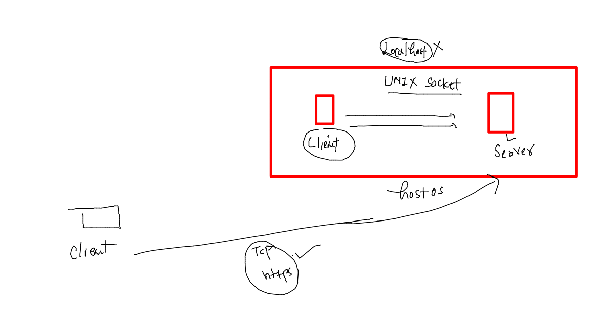
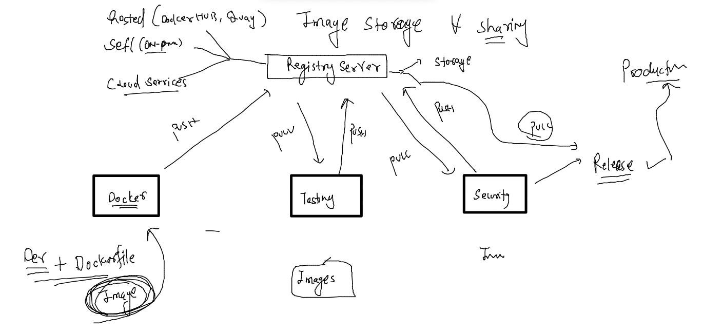
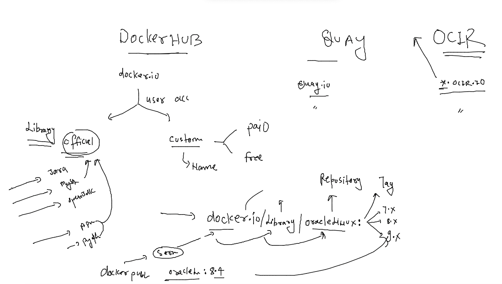
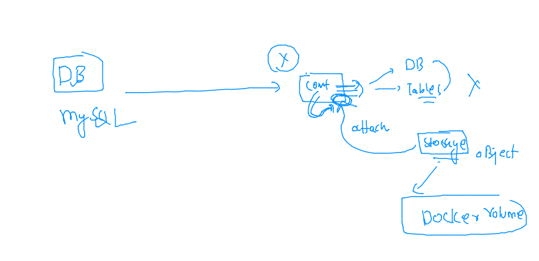

## Docker & K8s Training Plan 


### REvision 


### docker root directory system 

```
[root@docker-ce-server ~]# cd  /var/lib/docker/
[root@docker-ce-server docker]# ls
builder  buildkit  containers  image  network  overlay2  plugins  runtimes  swarm  tmp  trust  volumes
[root@docker-ce-server docker]# 


```

### Docker Client & server connection 




### PYthon code -- dockerfile 

```
FROM oraclelinux:8.4
LABEL name=ashutoshh
LABEL email=ashutoshh@linux.com 
# Info about image creator 
RUN yum install python3 -y && mkdir /newcode
ADD https://raw.githubusercontent.com/redashu/pythonLang/main/while.py /newcode/
# COPY and ADD both are same keyword but ADD can take data from URL as well
WORKDIR /newcode
# changing directory for this image 
CMD ["python3","while.py"]
# we are setting default process for this new image 
```

### lets build it 

```
[ashu@docker-ce-server ashuimages]$ ls
java  python  webapps
[ashu@docker-ce-server ashuimages]$ docker  build -t  ashupython:v1 python/ 
Sending build context to Docker daemon  2.048kB
Step 1/7 : FROM oraclelinux:8.4
 ---> 97e22ab49eea
Step 2/7 : LABEL name=ashutoshh
 ---> Running in 3b446f0534fc
Removing intermediate container 3b446f0534fc
 ---> 5acdbef27c75
Step 3/7 : LABEL email=ashutoshh@linux.com
 ---> Running in 8c074afa9d00
```
### checking it 

```
  149  docker  build -t  ashupython:v1 python/ 
  150  history 
[ashu@docker-ce-server ashuimages]$ docker images  |  grep ashu
ashupython                                     v1                  fe3d3c9e1a1a        35 seconds ago      448MB
ashujava                                       jdk8_v1             aa8d560c81d5        18 hours ago        652MB
ashujava                                       1.2                 7a5157c011f5        18 hours ago        464MB
ashujava                                       1.1                 56c67dfaca7a        18 hours ago        464MB
```

### creating container 

```
[ashu@docker-ce-server ashuimages]$ docker run -itd  --name ashupyc1  ashupython:v1  
03715d1e0a3d8ceac97c9797b2d1ac4bc6e8b3689b0e5a1b8fd0e2da131a3d32
[ashu@docker-ce-server ashuimages]$ docker  ps
CONTAINER ID        IMAGE               COMMAND                  CREATED             STATUS              PORTS               NAMES
62c40dfb90ab        gitapython:v1       "python3 while.py"       7 seconds ago       Up 3 seconds                            gitanjalic1
a0132d910d73        sooryapython:v1     "python3 /newcode/wh…"   8 seconds ago       Up 3 seconds                            soopythonc
aa0b1a6e1da7        99bda13f92d2        "python3 /newcode/wh…"   8 seconds ago       Up 3 seconds                            manjunathpythonc1
03715d1e0a3d        ashupython:v1       "python3 while.py"       11 seconds ago      Up 3 seconds                            ashupyc1
```

### checking logs 

```
[ashu@docker-ce-server ashuimages]$ docker  ps  |   grep ashu
03715d1e0a3d        ashupython:v1       "python3 while.py"       56 seconds ago      Up 48 seconds                           ashupyc1
[ashu@docker-ce-server ashuimages]$ docker logs  ashupyc1 
Hello all , welcome to python..!!
Welcome to LnB..
Welcome to Containers ..!!
______________________
Hello all , welcome to python..!!
Welcome to LnB..
```

### lets clean up 

```
  159  history 
[ashu@docker-ce-server ashuimages]$ docker  kill ashupyc1 
ashupyc1
[ashu@docker-ce-server ashuimages]$ docker rm ashupyc1 
ashupyc1
[ashu@docker-ce-server ashuimages]$ 
```

### alpine based python code dockerfile 

```
FROM alpine
label email=ashutoshh@linux.com
RUN apk add python3 && mkdir /pycodes/
# alpine is having apk as software installer 
ADD https://raw.githubusercontent.com/redashu/pythonLang/main/while.py /pycodes/
WORKDIR /pycodes
ENTRYPOINT python3 while.py 
```

### lets build it 
```
[ashu@docker-ce-server tasks]$ docker build -t ashualp:pycodev1  -f  alpine.dockerfile  . 
Sending build context to Docker daemon  2.048kB
Step 1/6 : FROM alpine
 ---> 9c6f07244728
Step 2/6 : label email=ashutoshh@linux.com
 ---> Running in 31f01ab8d32a
Removing intermediate container 31f01ab8d32a
 ---> c9c657472425
Step 3/6 : RUN apk add python3 && mkdi
```

### size diff

```
ashu@docker-ce-server tasks]$ docker images  |  grep ashu 
ashualp                                        pycodev1            b866ef88a55e        About a minute ago   55.8MB
ashupython                                     v1                  fe3d3c9e1a1a        47 minutes ago       448MB
ashujava                                       jdk8_v1             aa8d560c81d5        19 hours ago         652MB
ashujava                                       1.2
```

### Docker registires 



### Image name reality 



###  how image pull is happening 

```
[root@docker-ce-server ~]# docker  pull  openjdk 
Using default tag: latest
Trying to pull repository docker.io/library/openjdk ... 
latest: Pulling from docker.io/library/openjdk
Digest: sha256:e34cf9a1f6f7f4937f23e6e391b96d1b28fa16d0eeca2d4b131553a00df3add9
Status: Downloaded newer image for openjdk:latest
openjdk:latest
[root@docker-ce-server ~]# 
[root@docker-ce-server ~]# docker  pull  docker.io/library:openjdk:latest 

```

### pushing image on docker hub 

```
[ashu@docker-ce-server tasks]$ docker  images  |   grep ashu
ashualp                                        pycodev1            b866ef88a55e        About an hour ago   55.8MB
ashupython                                     v1                  fe3d3c9e1a1a        2 hours ago         448MB
ashujava                                       jdk8_v1             aa8d560c81d5        20 hours ago        652MB
ashujava                                       1.2                 7a5157c011f5        20 hours ago        464MB
[ashu@docker-ce-server tasks]$ 
[ashu@docker-ce-server tasks]$ docker  tag  ashualp:pycodev1   docker.io/dockerashu/oracleashu:pyappv1 
[ashu@docker-ce-server tasks]$ docker  login 
Login with your Docker ID to push and pull images from Docker Hub. If you don't have a Docker ID, head over to https://hub.docker.com to create one.
Username: dockerashu
Password: 
WARNING! Your password will be stored unencrypted in /home/ashu/.docker/config.json.
Configure a credential helper to remove this warning. See
https://docs.docker.com/engine/reference/commandline/login/#credentials-store

Login Succeeded
[ashu@docker-ce-server tasks]$ docker  push  docker.io/dockerashu/oracleashu:pyappv1 
The push refers to repository [docker.io/dockerashu/oracleashu]
b39fe6960a1f: Pushed 
da48a2b7529f: Pushed 
994393dc58e7: Mounted from library/alpine 
pyappv1: digest: sha256:d6e6eae62be07adee31b2aa1579fbde5927e63aa4de84a860c619f01a95b9950 size: 947
[ashu@docker-ce-server tasks]$ docker logout 
Removing login credentials for https://index.docker.io/v1/
```
### pushing in OCIR 

```
[ashu@docker-ce-server tasks]$ docker  tag  ashualp:pycodev1   phx.ocir.io/axmbtg8judkl/oracleashu:pyappv1 
[ashu@docker-ce-server tasks]$ 
[ashu@docker-ce-server tasks]$ 
[ashu@docker-ce-server tasks]$ docker images  |   grep ashu
phx.ocir.io/axmbtg8judkl/oracleashu            pyappv1             b866ef88a55e        About an hour ago   55.8MB
dockerashu/oracleashu                          pyappv1             b866ef88a55e        About an hour ago   55.8MB
ashualp                                        pycodev1            b866ef88a55e        About an hour ago   55.8MB
ashupython                                     v1                  fe3d3c9e1a1a        2 hours ago         448MB
ashujava                                       jdk8_v1             aa8d560c81d5        20 hours ago        652MB
ashujava                                       1.2                 7a5157c011f5        20 hours ago        464MB
[ashu@docker-ce-server tasks]$ 
[ashu@docker-ce-server tasks]$ docker login  phx.ocir.io 
Username: axmbtg8judkl/https://cloud.oracle.com/identity/users/ocid1.user.oc1..aaaaaaaavtp3l7ncmphthwcnuj5f7ruqntoid52nhqxr2vd5d5pwdatiwjba^C
[ashu@docker-ce-server tasks]$ docker login  phx.ocir.io 
Username: axmbtg8judkl/learntechbyme@gmail.com
Password: 
WARNING! Your password will be stored unencrypted in /home/ashu/.docker/config.json.
Configure a credential helper to remove this warning. See
https://docs.docker.com/engine/reference/commandline/login/#credentials-store

Login Succeeded
[ashu@docker-ce-server tasks]$ docker push phx.ocir.io/axmbtg8judkl/oracleashu:pyappv1
The push refers to repository [phx.ocir.io/axmbtg8judkl/oracleashu]
b39fe6960a1f: Pushed 
da48a2b7529f: Pushed 
994393dc58e7: Pushed 
pyappv1: digest: sha256:d6e6eae62be07adee31b2aa1579fbde5927e63aa4de84a860c619f01a95b9950 size: 947
[ashu@docker-ce-server tasks]$ docker logout phx.ocir.io 
Removing login credentials for phx.ocir.io
[ashu@docker-ce-server tasks]$ 
```

### pulling images

```
[ashu@docker-ce-server tasks]$ docker images
REPOSITORY          TAG                 IMAGE ID            CREATED             SIZE
[ashu@docker-ce-server tasks]$ 
[ashu@docker-ce-server tasks]$ docker pull  phx.ocir.io/axmbtg8judkl/oracleashu:pyappv1
Trying to pull repository phx.ocir.io/axmbtg8judkl/oracleashu ... 
pull access denied for phx.ocir.io/axmbtg8judkl/oracleashu, repository does not exist or may require 'docker login': denied: Anonymous users are only allowed read access on public repos
[ashu@docker-ce-server tasks]$ 
[ashu@docker-ce-server tasks]$ 
[ashu@docker-ce-server tasks]$ 
[ashu@docker-ce-server tasks]$ docker  pull   docker.io/dockerashu/oracleashu:pyappv1 
Trying to pull repository docker.io/dockerashu/oracleashu ... 
pyappv1: Pulling from docker.io/dockerashu/oracleashu
213ec9aee27d: Pull complete 
b2988275c326: Pull complete 
3156284dab58: Pull complete 
Digest: sha256:d6e6eae62be07adee31b2aa1579fbde5927e63aa4de84a860c619f01a95b9950
Status: Downloaded newer image for dockerashu/oracleashu:pyappv1
docker.io/dockerashu/oracleashu:pyappv1
[ashu@docker-ce-server tasks]$ docker  images
REPOSITORY              TAG                 IMAGE ID            CREATED             SIZE
dockerashu/oracleashu   pyappv1             b866ef88a55e        About an hour ago   55.8MB
```

## Introduciton Docker volume as an Storage object ..



### shell script to generate data 

```
#!/bin/sh
mkdir -p /mnt/data
while [ true ]
do
    date  >>/mnt/data/time.txt 
    sleep 10
    uptime  >>/mnt/data/load.txt 
    sleep 3 
done
```

### Dockerfile 

```
FROM alpine
label name=ashutoshh
add  datagen.sh /opt/
WORKDIR /opt
RUN chmod +x datagen.sh 
ENTRYPOINT ["./datagen.sh"]

```

### lets build image 

```
[ashu@docker-ce-server ashuimages]$ ls
java  python  storage  tasks  webapps
[ashu@docker-ce-server ashuimages]$ docker build -t ashustorage:v1  storage/
Sending build context to Docker daemon  3.072kB
Step 1/6 : FROM alpine
 ---> 9c6f07244728
Step 2/6 : label name=ashutoshh
 ---> Using cache
 ---> 3fbf18284e62
Step 3/6 : add  datagen.sh /opt/
 ---> 365cc5778c16
Step 4/6 : WORKDIR /opt
 ---> Running in e66305869e95
Removing intermediate container e66305869e95
 ---> 53edcdf89635
Step 5/6 : RUN chmod +x datagen.sh
 ---> Running in 432ef502e36d
Removing intermediate container 432ef502e36d
 ---> 7b05b995ccfa
Step 6/6 : ENTRYPOINT ["./datagen.sh"]
 ---> Running in f639c41addc9
Removing intermediate container f639c41addc9
 ---> 97bc1dfcde59
Successfully built 97bc1dfcde59
Successfully tagged ashustorage:v1
```

### creating container 

```
[ashu@docker-ce-server ashuimages]$ docker images  |   grep ashu
ashustorage                             v1                  97bc1dfcde59        3 minutes ago        5.54MB
dockerashu/oracleashu                   pyappv1             b866ef88a55e        3 hours ago          55.8MB
[ashu@docker-ce-server ashuimages]$ docker  run -itd --name ashutest1  ashustorage:v1 
2051400c0fcbc37d7d4652af49e63fe7e7257d9398c9e292bfb5df741ccb63fa
[ashu@docker-ce-server ashuimages]$ docker  ps
CONTAINER ID        IMAGE               COMMAND             CREATED             STATUS              PORTS               NAMES
2051400c0fcb        ashustorage:v1      "./datagen.sh"      4 seconds ago       Up 2 seconds                            ashutest1
[ashu@docker-ce-server ashuimages]$ 

```
### checking data 

```
[ashu@docker-ce-server ashuimages]$ docker  exec  -it  ashutest1  sh 
/opt # 
/opt # ls
datagen.sh
/opt # cd  /mnt/data/
/mnt/data # ls
load.txt  time.txt
/mnt/data # cat time.txt 
Tue Nov  8 09:04:35 UTC 2022
Tue Nov  8 09:04:48 UTC 2022
Tue Nov  8 09:05:01 UTC 2022
Tue Nov  8 09:05:14 UTC 2022
Tue Nov  8 09:05:27 UTC 2022
Tue Nov  8 09:05:40 UTC 2022
Tue Nov  8 09:05:53 UTC 2022
Tue Nov  8 09:06:06 UTC 2022
Tue Nov  8 09:06:19 UTC 2022
/mnt/data # cat  load.txt 
 09:04:45 up  4:54,  0 users,  load average: 0.56, 0.15, 0.04
 09:04:58 up  4:54,  0 users,  load average: 0.50, 0.16, 0.05
 09:05:11 up  4:54,  0 users,  load average: 0.39, 0.15, 0.04
 09:05:24 up  4:55,  0 users,  load average: 0.33, 0.14, 0.04
 09:05:37 up  4:55,  0 users,  load average: 0.25, 0.14, 0.04
 09:05:50 up  4:55,  0 users,  load average: 0.36, 0.16, 0.05
 09:06:03 up  4:55,  0 users,  load average: 0.28, 0.16, 0.05
 09:06:16 up  4:56,  0 users,  load average: 0.22, 0.15, 0.05
 09:06:29 up  4:56,  0 users,  load average: 0.18, 0.14, 0.05
```

### creating volume 

```
[ashu@docker-ce-server ashuimages]$ docker  volume  ls
DRIVER              VOLUME NAME
[ashu@docker-ce-server ashuimages]$ docker  volume  create  ashuvol-1
ashuvol-1
[ashu@docker-ce-server ashuimages]$ docker  volume  ls
DRIVER              VOLUME NAME
local               ashuvol-1
[ashu@docker-ce-server ashuimages]$ docker volume inspect ashuvol-1 
[
    {
        "CreatedAt": "2022-11-08T09:11:26Z",
        "Driver": "local",
        "Labels": {},
        "Mountpoint": "/var/lib/docker/volumes/ashuvol-1/_data",
        "Name": "ashuvol-1",
        "Options": {},
        "Scope": "local"
    }
]
```

### creating container with volume 

```
[ashu@docker-ce-server ashuimages]$ docker  volume  ls
DRIVER              VOLUME NAME
local               aishvol-1
local               ashuvol-1
local               gitavol-1
local               manjuvol-1
local               sonvol-1
local               sooryavol-1
local               venkatvol-1
[ashu@docker-ce-server ashuimages]$ docker  run -itd --name ashutest1   -v  ashuvol-1:/mnt/data/:rw       ashustorage:v1 
9d6f1dc0227635aa9a26a0317b53e13c123cf62495fdca2109535475fe2ead91
[ashu@docker-ce-server ashuimages]$ 
[ashu@docker-ce-server ashuimages]$ docker  ps
CONTAINER ID        IMAGE               COMMAND             CREATED             STATUS              PORTS               NAMES
9d6f1dc02276        ashustorage:v1      "./datagen.sh"      5 seconds ago       Up 5 seconds                            ashutest1
3f6d283a3fc6        manjustorage:1.0    "./datagen.sh"      20 seconds ago      Up 19 seconds                           manjutest1
[ashu@docker-ce-server ashuimages]$ 
[ashu@docker-ce-server ashuimages]$ 
```

### lets check volume for data present 

```
[ashu@docker-ce-server ashuimages]$ docker  run -it --rm  -v  ashuvol-1:/tmp/mydata:ro   oraclelinux:8.4   bash 
Unable to find image 'oraclelinux:8.4' locally
Trying to pull repository docker.io/library/oraclelinux ... 
8.4: Pulling from docker.io/library/oraclelinux
a4df6f21af84: Pull complete 
Digest: sha256:b81d5b0638bb67030b207d28586d0e714a811cc612396dbe3410db406998b3ad
Status: Downloaded newer image for oraclelinux:8.4
[root@85bf189a54c6 /]# 
[root@85bf189a54c6 /]# 
[root@85bf189a54c6 /]# cd  /tmp/mydata/
[root@85bf189a54c6 mydata]# ls
load.txt  time.txt
[root@85bf189a54c6 mydata]# rm time.txt 
rm: remove regular file 'time.txt'? y
rm: cannot remove 'time.txt': Read-only file system
[root@85bf189a54c6 mydata]# cat  load.txt 
 09:16:31 up  5:06,  0 users,  load average: 0.42, 0.22, 0.10
 09:16:44 up  5:06,  0 users,  load average: 0.43, 0.23, 0.10
 09:16:57 up  5:06,  0 users,  load average: 0.33, 0.22, 0.10
 09:17:10 up  5:06,  0 users,  load average: 0.28, 0.21, 0.10
```
### creating a database container with volume 

```
[ashu@docker-ce-server ashuimages]$ docker  volume  create ashudb-vol1 
ashudb-vol1
[ashu@docker-ce-server ashuimages]$ docker  volume  ls
DRIVER              VOLUME NAME
local               aishvol-1
local               ashudb-vol1
local               ashuvol-1
local               gitavol-1
local               hari
local               manjuvol-1
local               navneet-1
local               sbvol-1
local               sonvol-1
local               sooryavol-1
local               venkatvol-1
[ashu@docker-ce-server ashuimages]$ docker  run  --name  ashudb1 -d -v ashudb-vol1:/var/lib/mysql/  -e MYSQL_ROOT_PASSWORD="Ordb@123"  mysql
Unable to find image 'mysql:latest' locally
Trying to pull repository docker.io/library/mysql ... 
latest: Pulling from docker.io/library/mysql
feec22b5b798: Pull complete 
3b33952322b1: Pull complete 
8632ee03bb1c: Pull complete 
636ccd115361: Pull complete 
b07c8fac8eea: Pull complete 
e44c54db9c14: Pull complete 
cf9c45749101: Pull complete 
9f2fa3febc47: Pull complete 
44d5e1d3c311: Pull complete 
bb3db2c5d8ec: Pull complete 
e0ead729abd9: Pull complete 
Digest: sha256:717e6f25ed8997b7ecb0408e063c4dcba202a68b341ebac4c4d97f51439b87ee
Status: Downloaded newer image for mysql:latest
e2719aea4f748a4744d912d6ce537d6e96a1dff5cfad1743d38828b3c72fa3cf
[ashu@docker-ce-server ashuimages]$ docker  ps
CONTAINER ID        IMAGE               COMMAND                  CREATED             STATUS              PORTS                 NAMES
2b22b04b89c3        mysql               "docker-entrypoint.s…"   4 seconds ago       Up 3 seconds        3306/tcp, 33060/tcp   sbdb1
e2719aea4f74        mysql               "docker-entrypoint.s…"   13 seconds ago      Up 3 seconds        3306/tcp, 33060/tcp   ashudb1
[ashu@docker-ce-server ashuimages]$ 
```

### access db container and create some databases 

```
[ashu@docker-ce-server ashuimages]$ docker  exec -it  ashudb1  bash 
bash-4.4# 
bash-4.4# mysql -u root -P
mysql: [ERROR] mysql: option '-P' requires an argument.
bash-4.4# mysql -u root -p
Enter password: 
Welcome to the MySQL monitor.  Commands end with ; or \g.
Your MySQL connection id is 8
Server version: 8.0.31 MySQL Community Server - GPL

Copyright (c) 2000, 2022, Oracle and/or its affiliates.

Oracle is a registered trademark of Oracle Corporation and/or its
affiliates. Other names may be trademarks of their respective
owners.

Type 'help;' or '\h' for help. Type '\c' to clear the current input statement.

mysql> show databases;
+--------------------+
| Database           |
+--------------------+
| information_schema |
| mysql              |
| performance_schema |
| sys                |
+--------------------+
4 rows in set (0.00 sec)

mysql> create  database hello-oracle;
ERROR 1064 (42000): You have an error in your SQL syntax; check the manual that corresponds to your MySQL server version for the right syntax to use near '-oracle' at line 1
mysql> create  database hellooracle;
Query OK, 1 row affected (0.00 sec)

mysql> show databases;
+--------------------+
| Database           |
+--------------------+
| hellooracle        |
| information_schema |
| mysql              |
| performance_schema |
| sys                |
+--------------------+
5 rows in set (0.00 sec)

mysql> exit;
Bye
bash-4.4# exit
[ashu@docker-ce-server ashuimages]$ 
```

### lets clean up 

```
[ashu@docker-ce-server ashuimages]$ docker kill ashudb1 
ashudb1
[ashu@docker-ce-server ashuimages]$ docker rm ashudb1 
ashudb1
[ashu@docker-ce-server ashuimages]$ docker volume rm ashuvol-1 
ashuvol-1
[ashu@docker-ce-server ashuimages]$ 
[ashu@docker-ce-server ashuimages]$ 
```


