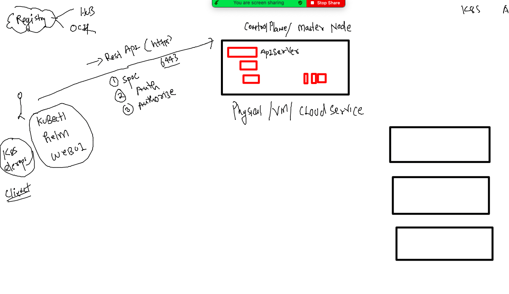

## Docker & K8s Training Plan 


### Revision 


## Understanding k8s architecture again 

### k8s client to control plane 



### checking k8s client version 

```
[ashu@docker-ce-server ashuimages]$ kubectl  version --client -o yaml 
clientVersion:
  buildDate: "2022-10-12T10:57:26Z"
  compiler: gc
  gitCommit: 434bfd82814af038ad94d62ebe59b133fcb50506
  gitTreeState: clean
  gitVersion: v1.25.3
  goVersion: go1.19.2
  major: "1"
  minor: "25"
  platform: linux/amd64
kustomizeVersion: v4.5.7
```

### auth file on master node which needs to be shared to all k8s engineers 

```
[root@masternode ~]# cd  /etc/kubernetes/
[root@masternode kubernetes]# ls
admin.conf
```

### Now sending request 

```
[ashu@docker-ce-server ashuimages]$ ls
admin.conf  ashu-compose  java  python  storage  tasks  webapps
[ashu@docker-ce-server ashuimages]$ 
[ashu@docker-ce-server ashuimages]$ kubectl   get  nodes  --kubeconfig admin.conf 
NAME         STATUS   ROLES           AGE   VERSION
masternode   Ready    control-plane   18h   v1.25.3
minion1      Ready    <none>          18h   v1.25.3
minion2      Ready    <none>          18h   v1.25.3
[ashu@docker-ce-server ashuimages]$ kubectl  version -o yaml   --kubeconfig admin.conf 
clientVersion:
  buildDate: "2022-10-12T10:57:26Z"
  compiler: gc
  gitCommit: 434bfd82814af038ad94d62ebe59b133fcb50506
  gitTreeState: clean
  gitVersion: v1.25.3
  goVersion: go1.19.2
  major: "1"
  minor: "25"
  platform: linux/amd64
kustomizeVersion: v4.5.7
serverVersion:
  buildDate: "2022-10-12T10:49:09Z"
  compiler: gc
  gitCommit: 434bfd82814af038ad94d62ebe59b133fcb50506
  gitTreeState: clean
  gitVersion: v1.25.3
  goVersion: go1.19.2
  major: "1"
  minor: "25"
  platform: linux/amd64
```

### copying  default location of kubeconf file 

```
[ashu@docker-ce-server ashuimages]$ mkdir ~/.kube 
mkdir: cannot create directory ‘/home/ashu/.kube’: File exists
[ashu@docker-ce-server ashuimages]$ 
[ashu@docker-ce-server ashuimages]$ 
[ashu@docker-ce-server ashuimages]$ cp -v admin.conf   ~/.kube/config 
‘admin.conf’ -> ‘/home/ashu/.kube/config’
[ashu@docker-ce-server ashuimages]$ 
[ashu@docker-ce-server ashuimages]$ 
[ashu@docker-ce-server ashuimages]$ 
[ashu@docker-ce-server ashuimages]$ kubectl  get nodes 
NAME         STATUS   ROLES           AGE   VERSION
masternode   Ready    control-plane   18h   v1.25.3
minion1      Ready    <none>          18h   v1.25.3
minion2      Ready    <none>          18h   v1.25.3
```

### taking javawebapp sample 

```
git clone https://github.com/redashu/javawebapp.git
  394  ls
  395  ls  javawebapp/
  396  ls
  397  mv  javawebapp/  ashujavawebapp
  398  ls
  399  ls  ashujavawebapp/
  400  history 
  401  ls
  402  cd  ashujavawebapp/
```

### adding compose file to ashujavawebapp folder 

```
version: '3.8'
services:
  ashuapp1:
    image: ashujavaweb:appv1 # image i want to build
    build: 
      context: . # location of dockerfile 
      dockerfile: Dockerfile # name of dockerfile 
    container_name: ashuc1
    ports:
    - 1234:8080 
```

### running compose 

```
[ashu@docker-ce-server ashujavawebapp]$ docker-compose up -d --build 
[+] Building 0.6s (10/10) FINISHED                                                               
 => [internal] load build definition from Dockerfile                                        0.0s
 => => transferring dockerfile: 91B                                                         0.0s
 => [internal] load .dockerignore                                                           0.0s
 => => transferring context: 2B                                                             0.0s
 => [internal] load metadata for docker.io/library/tomcat:latest                            0.6s
 => [1/5] FROM docker.io/library/tomcat@sha256:5de987eeafd1182f31af7c97580d2a2bd06a1a27996  0.0s
 => [internal] load build context                                                           0.0s
 => => transferring context: 565B                                                           0.0s
 => CACHED [2/5] WORKDIR /usr/local/tomcat/webapps                                          0.0s
 => CACHED [3/5] RUN mkdir oracle                                                           0.0s
 => CACHED [4/5] WORKDIR oracle                                                             0.0s
 => CACHED [5/5] ADD myapp .                                                                0.0s
 => exporting to image                                                                      0.0s
 => => exporting layers                                                                     0.0s
 => => writing image sha256:5d14c38ccc4e6201b08448ce7b7738cc286eba0abdb0c8e6cd5249de1de144  0.0s
 => => naming to docker.io/library/ashujavaweb:appv1                                        0.0s
[+] Running 1/0
 ⠿ Container ashuc1  Running                                                                0.0s
[ashu@docker-ce-server ashujavawebapp]$ docker-compose  ps
NAME                COMMAND             SERVICE             STATUS              PORTS
ashuc1              "catalina.sh run"   ashuapp1            running             0.0.0.0:1234->8080/tcp
```
### lets push image to personal dockerhub account 

```
[root@docker-ce-server ~]# docker images   |  grep ashu
ashujavaweb         appv1               a0dc13fd0658        6 minutes ago       474MB
[root@docker-ce-server ~]# 
[root@docker-ce-server ~]# 
[root@docker-ce-server ~]# 
[root@docker-ce-server ~]# docker  tag  a0dc13fd0658   docker.io/dockerashu/ashujavaweb:appv1 
[root@docker-ce-server ~]# docker login 
Login with your Docker ID to push and pull images from Docker Hub. If you don't have a Docker ID, head over to https://hub.docker.com to create one.
Username: dockerashu
Password: 
WARNING! Your password will be stored unencrypted in /root/.docker/config.json.
Configure a credential helper to remove this warning. See
https://docs.docker.com/engine/reference/commandline/login/#credentials-store

Login Succeeded
[root@docker-ce-server ~]# docker push  docker.io/dockerashu/ashujavaweb:appv1
The push refers to repository [docker.io/dockerashu/ashujavaweb]
2f4c3e0bfad3: Pushed 
5f70bf18a086: Pushed 
dddf6dae16f7: Pushed 
21dc488a6ae1: Mounted from library/tomcat 
4fabb329db7d: Mounted from library/tomcat 
fc85d6aaa33d: Mounted from library/tomcat 
61daadd08923: Mounted from library/tomcat 
cafbfaab627b: Mounted from library/tomcat 
3a87162a073c: Mounted from library/tomcat 
f4a670ac65b6: Mounted from library/tomcat 
appv1: digest: sha256:64af86493cb0fb93df6276eb9a49c9659dea89629146beb412670e89213c438f size: 2616
[root@docker-ce-server ~]# docker logout 
Removing login credentials for https://index.docker.io/v1/
```

## Designing Pod 

### creating pod YAML 

```
apiVersion: 'v1' # to send pod request apiServer version 
kind: Pod # sending request for pod only
metadata: # info about kind 
  name: ashupod-javawebapp # name of pod 
spec: # app Resources like storage,security,containers details
  containers: 
  - name: ashuc1 
    image: docker.io/dockerashu/ashujavaweb:appv1 
    ports:
    - containerPort: 8080 
```

### lets deploy it 

```
[ashu@docker-ce-server k8s-app-deploy]$ kubectl  apply -f  ashupod.yaml 
pod/ashupod-javawebapp unchanged
[ashu@docker-ce-server k8s-app-deploy]$ kubectl   get  pods
NAME                    READY   STATUS             RESTARTS   AGE
aishpod-javawebapp      1/1     Running            0          4m39s
ashupod-javawebapp      1/1     Running            0          5m5s
gitapod-javawebapp      1/1     Running            0          11s
```

### pod operations in detail

### 

```
[ashu@docker-ce-server ~]$ kubectl  get po -o wide
NAME                    READY   STATUS    RESTARTS   AGE   IP                NODE      NOMINATED NODE   READINESS GATES
aishpod-javawebapp      1/1     Running   0          40m   192.168.34.4      minion1   <none>           <none>
ashupod-javawebapp      1/1     Running   0          40m   192.168.34.1      minion1   <none>           <none>
gitapod-javawebapp      1/1     Running   0          35m   192.168.179.202   minion2   <none>           <none>
haripod-javawebapp      1/1     Running   0          24m   192.168.179.203   minion2   <none>           <none>

```

### checking pod info in detail 

```
[ashu@docker-ce-server ~]$ kubectl  describe pod ashupod-javawebapp 
Name:             ashupod-javawebapp
Namespace:        default
Priority:         0
Service Account:  default
Node:             minion1/10.0.0.249
Start Time:       Thu, 10 Nov 2022 05:30:49 +0000
Labels:           <none>
Annotations:      cni.projectcalico.org/containerID: 082c5ddd2ed1ff8aef03ff8442ac56fc79d39b8bc961ad91416c293db40b62f6
                  cni.projectcalico.org/podIP: 192.168.34.1/32
                  cni.projectcalico.org/podIPs: 192.168.34.1/32
Status:           Running
IP:               192.168.34.1
IPs:
  IP:  192.168.34.1
Containers:
  ashuc1:
    Container ID:   containerd://7d4e16e0eb3656454f447b8897f9eb376f63b720912096d2c60f3df6d84ae3e1
    Image:          docker.io/dockerashu/ashujavaweb:appv1
    Image ID:       docker.io/dockerashu/ashujavaweb@sha256:64af86493cb0fb93df6276eb9a49c9659dea89629146beb412670e89213c438f
    Port:           8080/TCP
    Host Port:      0/TCP
    State:          Running
      Started:      Thu, 10 Nov 2022 05:31:08 +0000
    Ready:          True
    Restart Count:  0
    Environment:    <none>
    Mounts:
      /var/run/secrets/kubernetes.io/serviceaccount from kube-api-access-frk87 (ro)
Conditions:
  Type              Status
  Initialized       True 
  Ready             True 
  ContainersReady   True 
  PodScheduled      True 
Volumes:
  kube-api-access-frk87:
    Type:                    Projected (a volume that contains injected data from multiple sources)
    TokenExpirationSeconds:  3607
    ConfigMapName:           kube-root-ca.crt
    ConfigMapOptional:       <nil>
    DownwardAPI:             true
QoS Class:                   BestEffort
Node-Selectors:              <none>
Tolerations:                 node.kubernetes.io/not-ready:NoExecute op=Exists for 300s
                             node.kubernetes.io/unreachable:NoExecute op=Exists for 300s
Events:
  Type    Reason     Age   From               Message
  ----    ------     ----  ----               -------
  Normal  Scheduled  43m   default-scheduler  Successfully assigned default/ashupod-javawebapp to minion1
  Normal  Pulling    43m   kubelet            Pulling image "docker.io/dockerashu/ashujavaweb:appv1"
  Normal  Pulled     43m   kubelet            Successfully pulled image "docker.io/dockerashu/ashujavaweb:appv1" in 10.027514903s
  Normal  Created    43m   kubelet            Created container ashuc1
  Normal  Started    43m   kubelet            Started container ashuc1
```

### checking logs 

```
[ashu@docker-ce-server ~]$ kubectl  logs  ashupod-javawebapp
NOTE: Picked up JDK_JAVA_OPTIONS:  --add-opens=java.base/java.lang=ALL-UNNAMED --add-opens=java.base/java.io=ALL-UNNAMED --add-opens=java.base/java.util=ALL-UNNAMED --add-opens=java.base/java.util.concurrent=ALL-UNNAMED --add-opens=java.rmi/sun.rmi.transport=ALL-UNNAMED
10-Nov-2022 05:31:08.390 INFO [main] org.apache.catalina.startup.VersionLoggerListener.log Server version name:   Apache Tomcat/10.1.1
10-Nov-2022 05:31:08.393 INFO [main] org.apache.catalina.startup.VersionLoggerListener.log Server built:          Oct 3 2022 12:42:14 UTC
10-Nov-2022 05:31:08.394 INFO [main] org.apache.catalina.startup.VersionLoggerListener.log Server version number: 10.1.1.0
10-Nov-2022 05:31:08.394 INFO [main] org.apache.catalina.startup.VersionLoggerListener.log OS Name:               Linux
10-Nov-2022 05:31:08.394 INFO [main] org.apache.catalina.startup.VersionLoggerListener.log OS Version:            5.4.17-2136.311.6.1.el7uek.x86_64
10-Nov-2022 05:31:08.394 INFO [main] org.apache.catalina.startup.VersionLoggerListener.log Architecture:          amd64
10-Nov-2022 05:31:08.394 INFO [main] org.apache.cata
```

### access container running inside pod 

```
[ashu@docker-ce-server ~]$ kubectl  exec -it ashupod-javawebapp  -- bash 
root@ashupod-javawebapp:/usr/local/tomcat/webapps/oracle# 
root@ashupod-javawebapp:/usr/local/tomcat/webapps/oracle# 
root@ashupod-javawebapp:/usr/local/tomcat/webapps/oracle# 
root@ashupod-javawebapp:/usr/local/tomcat/webapps/oracle# ls
devops.png  index.html  WEB-INF  welcome.jsp
root@ashupod-javawebapp:/usr/local/tomcat/webapps/oracle# cd /
root@ashupod-javawebapp:/# ls
bin  boot  dev  etc  home  lib  lib32  lib64  libx32  media  mnt  opt  proc  root  run  sbin  srv  sys  tmp  usr  var
root@ashupod-javawebapp:/# cat  /etc/os-release 
PRETTY_NAME="Ubuntu 22.04.1 LTS"
NAME="Ubuntu"
VERSION_ID="22.04"
VERSION="22.04.1 LTS (Jammy Jellyfish)"
VERSION_CODENAME=jammy
ID=ubuntu
ID_LIKE=debian
HOME_URL="https://www.ubuntu.com/"
SUPPORT_URL="https://help.ubuntu.com/"
BUG_REPORT_URL="https://bugs.launchpad.net/ubuntu/"
PRIVACY_POLICY_URL="https://www.ubuntu.com/legal/terms-and-policies/privacy-policy"
UBUNTU_CODENAME=jammy
root@ashupod-javawebapp:/# exit
exit
[ashu@docker-ce-server ~]$ 

```

### deleting pod 

```
[ashu@docker-ce-server ~]$ kubectl  delete pod ashupod-javawebapp
pod "ashupod-javawebapp" deleted
```


