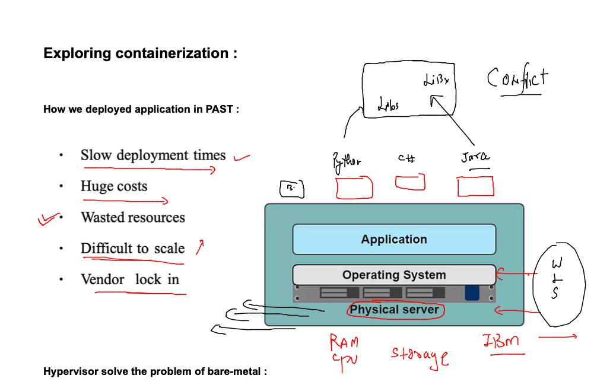
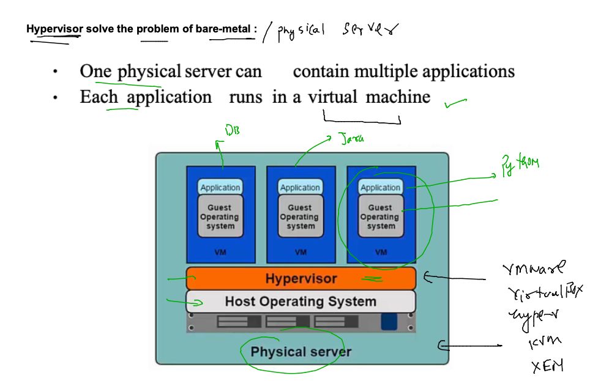
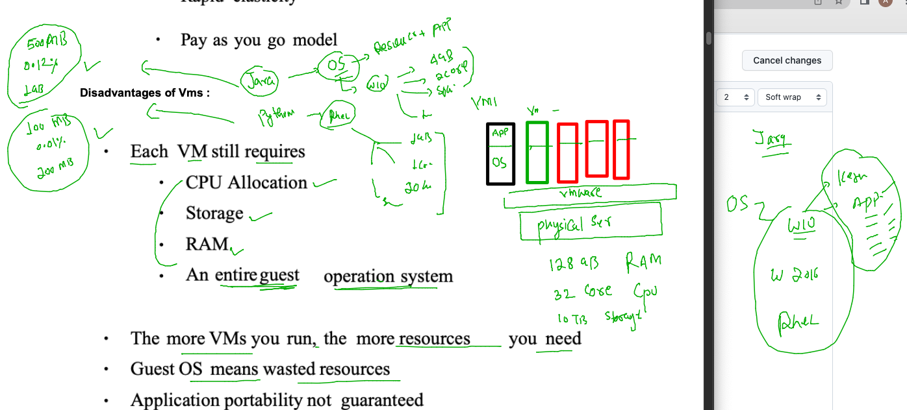
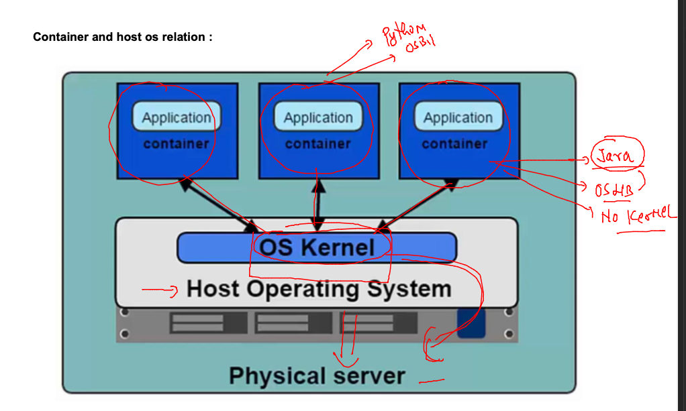
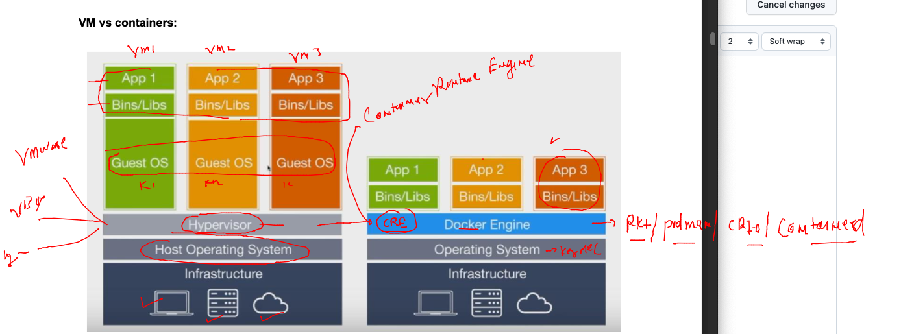
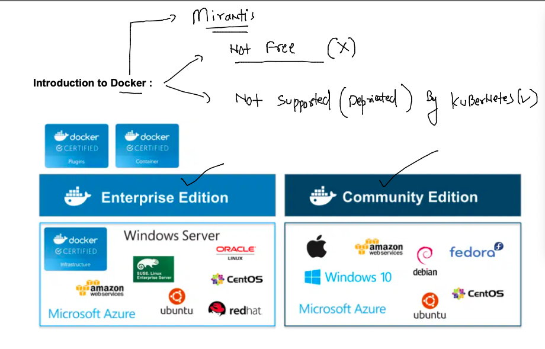

## Docker & K8s Training Plan 


### problem with bare-metal servers while deploying / testing app



### introduction to virtualization using hypervisor 



### understanding problem with VM 



## Introduction to Kernel 



### Container vs VM 



## Introduction to Docker 



### Docker support in OS kernel 


### Installing docker on ORacle LInux in OCI 

```
root@docker-ce-server ~]# yum  install docker 
Failed to set locale, defaulting to C
Loaded plugins: langpacks, ulninfo
ol7_MySQL80                                                                                 | 3.0 kB  00:00:00     
ol7_MySQL80_connectors_community                                                            | 2.9 kB  00:00:00     
ol7_MySQL80_tools_c

================================================================================================================
Install  1 Package (+7 Dependent packages)

Total download size: 87 M
Installed size: 356 M
Is this ok [y/d/N]: yy
Is this ok [y/d/N]: y
Downloading packages:
(1/8): container-selinux-2.119.2-1.911c772.el7_8.noarch.rpm                                 |  39 kB  00:00:00     
(2/8): criu-3.12-2.el7.x86_64.rpm                                                           | 452 kB  00:00:00     
(3/8): containerd-1.4.8-1.el7.x86_64.rpm                                                    |  29 MB  00:00:00     
(4/8): docker-cli-19.03.11.ol-13.el7.x86_64.rpm                                             |  33 MB  00:00:00     
(5/8): runc-1.1.3-1.el7.x86_64.rpm                                                          | 2.9 MB  00:00:00     
(6/8): docker-engine-19.03.11.ol-13.el7.x86_64.rpm                                          |  21 MB  00:00:00     
(7/8): libnet-1.1.6-7.el7.x86_64.rpm                                                        |  57 kB  00:00:00     
(8/8): protobuf-c-1.0.2-3.el7.x86_64.rpm                                                    |  27 kB  00:00:00     
-------------------------------------------------------------------------------------------------------------------
Total                                                                              144 MB/s |  87 MB  00:00:00     
Running transaction check
Running transaction test


```


### starting docker service and making it persistent 

```
[root@docker-ce-server ~]# systemctl start  docker 
[root@docker-ce-server ~]# systemctl enable   docker 
Created symlink from /etc/systemd/system/multi-user.target.wants/docker.service to /usr/lib/systemd/system/docker.service.
[root@docker-ce-server ~]# systemctl  status    docker 
● docker.service - Docker Application Container Engine
   Loaded: loaded (/usr/lib/systemd/system/docker.service; enabled; vendor preset: disabled)
   Active: active (running) since Mon 2022-11-07 05:50:27 GMT; 16s ago
     Docs: https://docs.docker.com
 Main PID: 16149 (dockerd)
   CGroup: /system.slice/docker.service
           └─16149 /usr/bin/dockerd -H fd:// --containerd=/run/containerd/containerd.sock


```

### giving docker service access to a non root user 

```
[root@docker-ce-server ~]# 
[root@docker-ce-server ~]# cat  /etc/group   |   grep -i docker 
docker:x:992:
[root@docker-ce-server ~]# 
[root@docker-ce-server ~]# usermod -aG docker  ashu
[root@docker-ce-server ~]# 
[root@docker-ce-server ~]# 
[root@docker-ce-server ~]# cat  /etc/group   |   grep -i docker 
docker:x:992:ashu
[root@docker-ce-server ~]# 


```

### lets check 

```
[ashu@docker-ce-server ~]$ docker  version 
Client: Docker Engine - Community
 Version:           19.03.11-ol
 API version:       1.40
 Go version:        go1.16.2
 Git commit:        9bb540d
 Built:             Fri Jul 23 01:33:55 2021
 OS/Arch:           linux/amd64
 Experimental:      false

Server: Docker Engine - Community
 Engine:
  Version:          19.03.11-ol
  API version:      1.40 (minimum version 1.12)
  Go version:       go1.16.2
  Git commit:       9bb540d
  Built:            Fri Jul 23 01:32:08 2021
  OS/Arch:          linux/amd64
  Experimental:     false
  Default Registry: docker.io
 containerd:
  Version:          v1.4.8

```


