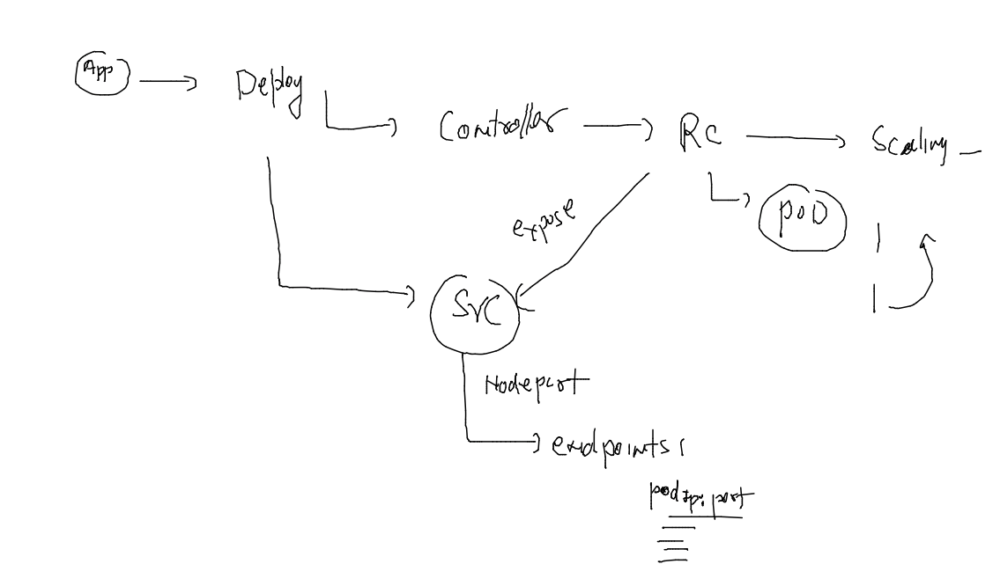
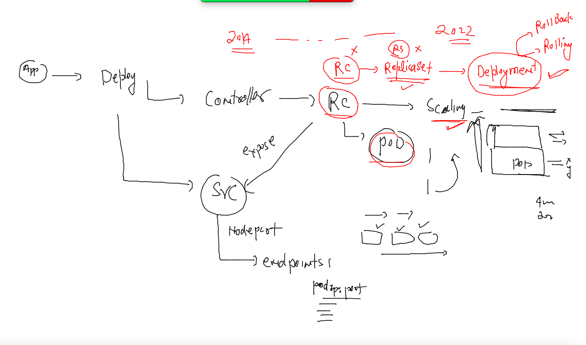
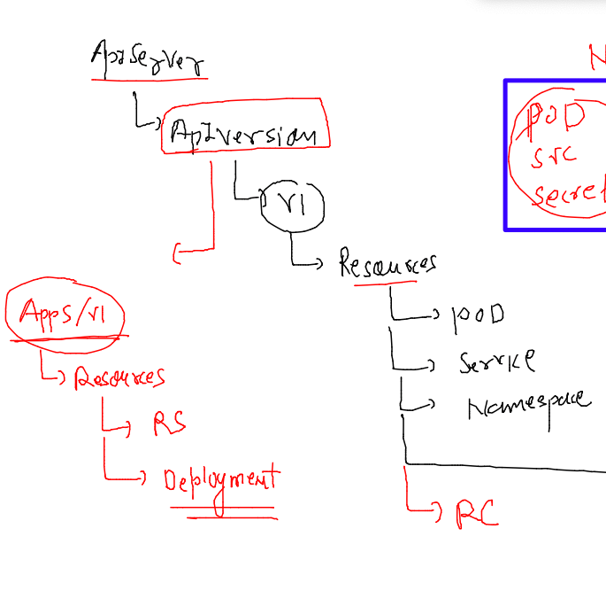

## Docker & K8s Training Plan 


### Revision 


## Understanding k8s architecture again 

### k8s client to control plane 


### checking k8s client version 

```
[ashu@docker-ce-server ashuimages]$ kubectl  version --client -o yaml 
clientVersion:
  buildDate: "2022-10-12T10:57:26Z"
  compiler: gc
  gitCommit: 434bfd82814af038ad94d62ebe59b133fcb50506
  gitTreeState: clean
  gitVersion: v1.25.3
  goVersion: go1.19.2
  major: "1"
  minor: "25"
  platform: linux/amd64
kustomizeVersion: v4.5.7
```

### auth file on master node which needs to be shared to all k8s engineers 

```
[root@masternode ~]# cd  /etc/kubernetes/
[root@masternode kubernetes]# ls
admin.conf
```

### Now sending request 

```
[ashu@docker-ce-server ashuimages]$ ls
admin.conf  ashu-compose  java  python  storage  tasks  webapps
[ashu@docker-ce-server ashuimages]$ 
[ashu@docker-ce-server ashuimages]$ kubectl   get  nodes  --kubeconfig admin.conf 
NAME         STATUS   ROLES           AGE   VERSION
masternode   Ready    control-plane   18h   v1.25.3
minion1      Ready    <none>          18h   v1.25.3
minion2      Ready    <none>          18h   v1.25.3
[ashu@docker-ce-server ashuimages]$ kubectl  version -o yaml   --kubeconfig admin.conf 
clientVersion:
  buildDate: "2022-10-12T10:57:26Z"
  compiler: gc
  gitCommit: 434bfd82814af038ad94d62ebe59b133fcb50506
  gitTreeState: clean
  gitVersion: v1.25.3
  goVersion: go1.19.2
  major: "1"
  minor: "25"
  platform: linux/amd64
kustomizeVersion: v4.5.7
serverVersion:
  buildDate: "2022-10-12T10:49:09Z"
  compiler: gc
  gitCommit: 434bfd82814af038ad94d62ebe59b133fcb50506
  gitTreeState: clean
  gitVersion: v1.25.3
  goVersion: go1.19.2
  major: "1"
  minor: "25"
  platform: linux/amd64
```

### copying  default location of kubeconf file 

```
[ashu@docker-ce-server ashuimages]$ mkdir ~/.kube 
mkdir: cannot create directory ‘/home/ashu/.kube’: File exists
[ashu@docker-ce-server ashuimages]$ 
[ashu@docker-ce-server ashuimages]$ 
[ashu@docker-ce-server ashuimages]$ cp -v admin.conf   ~/.kube/config 
‘admin.conf’ -> ‘/home/ashu/.kube/config’
[ashu@docker-ce-server ashuimages]$ 
[ashu@docker-ce-server ashuimages]$ 
[ashu@docker-ce-server ashuimages]$ 
[ashu@docker-ce-server ashuimages]$ kubectl  get nodes 
NAME         STATUS   ROLES           AGE   VERSION
masternode   Ready    control-plane   18h   v1.25.3
minion1      Ready    <none>          18h   v1.25.3
minion2      Ready    <none>          18h   v1.25.3
```

### taking javawebapp sample 

```
git clone https://github.com/redashu/javawebapp.git
  394  ls
  395  ls  javawebapp/
  396  ls
  397  mv  javawebapp/  ashujavawebapp
  398  ls
  399  ls  ashujavawebapp/
  400  history 
  401  ls
  402  cd  ashujavawebapp/
```

### adding compose file to ashujavawebapp folder 

```
version: '3.8'
services:
  ashuapp1:
    image: ashujavaweb:appv1 # image i want to build
    build: 
      context: . # location of dockerfile 
      dockerfile: Dockerfile # name of dockerfile 
    container_name: ashuc1
    ports:
    - 1234:8080 
```

### running compose 

```
[ashu@docker-ce-server ashujavawebapp]$ docker-compose up -d --build 
[+] Building 0.6s (10/10) FINISHED                                                               
 => [internal] load build definition from Dockerfile                                        0.0s
 => => transferring dockerfile: 91B                                                         0.0s
 => [internal] load .dockerignore                                                           0.0s
 => => transferring context: 2B                                                             0.0s
 => [internal] load metadata for docker.io/library/tomcat:latest                            0.6s
 => [1/5] FROM docker.io/library/tomcat@sha256:5de987eeafd1182f31af7c97580d2a2bd06a1a27996  0.0s
 => [internal] load build context                                                           0.0s
 => => transferring context: 565B                                                           0.0s
 => CACHED [2/5] WORKDIR /usr/local/tomcat/webapps                                          0.0s
 => CACHED [3/5] RUN mkdir oracle                                                           0.0s
 => CACHED [4/5] WORKDIR oracle                                                             0.0s
 => CACHED [5/5] ADD myapp .                                                                0.0s
 => exporting to image                                                                      0.0s
 => => exporting layers                                                                     0.0s
 => => writing image sha256:5d14c38ccc4e6201b08448ce7b7738cc286eba0abdb0c8e6cd5249de1de144  0.0s
 => => naming to docker.io/library/ashujavaweb:appv1                                        0.0s
[+] Running 1/0
 ⠿ Container ashuc1  Running                                                                0.0s
[ashu@docker-ce-server ashujavawebapp]$ docker-compose  ps
NAME                COMMAND             SERVICE             STATUS              PORTS
ashuc1              "catalina.sh run"   ashuapp1            running             0.0.0.0:1234->8080/tcp
```
### lets push image to personal dockerhub account 

```
[root@docker-ce-server ~]# docker images   |  grep ashu
ashujavaweb         appv1               a0dc13fd0658        6 minutes ago       474MB
[root@docker-ce-server ~]# 
[root@docker-ce-server ~]# 
[root@docker-ce-server ~]# 
[root@docker-ce-server ~]# docker  tag  a0dc13fd0658   docker.io/dockerashu/ashujavaweb:appv1 
[root@docker-ce-server ~]# docker login 
Login with your Docker ID to push and pull images from Docker Hub. If you don't have a Docker ID, head over to https://hub.docker.com to create one.
Username: dockerashu
Password: 
WARNING! Your password will be stored unencrypted in /root/.docker/config.json.
Configure a credential helper to remove this warning. See
https://docs.docker.com/engine/reference/commandline/login/#credentials-store

Login Succeeded
[root@docker-ce-server ~]# docker push  docker.io/dockerashu/ashujavaweb:appv1
The push refers to repository [docker.io/dockerashu/ashujavaweb]
2f4c3e0bfad3: Pushed 
5f70bf18a086: Pushed 
dddf6dae16f7: Pushed 
21dc488a6ae1: Mounted from library/tomcat 
4fabb329db7d: Mounted from library/tomcat 
fc85d6aaa33d: Mounted from library/tomcat 
61daadd08923: Mounted from library/tomcat 
cafbfaab627b: Mounted from library/tomcat 
3a87162a073c: Mounted from library/tomcat 
f4a670ac65b6: Mounted from library/tomcat 
appv1: digest: sha256:64af86493cb0fb93df6276eb9a49c9659dea89629146beb412670e89213c438f size: 2616
[root@docker-ce-server ~]# docker logout 
Removing login credentials for https://index.docker.io/v1/
```

## Designing Pod 

### creating pod YAML 

```
apiVersion: 'v1' # to send pod request apiServer version 
kind: Pod # sending request for pod only
metadata: # info about kind 
  name: ashupod-javawebapp # name of pod 
spec: # app Resources like storage,security,containers details
  containers: 
  - name: ashuc1 
    image: docker.io/dockerashu/ashujavaweb:appv1 
    ports:
    - containerPort: 8080 
```

### lets deploy it 

```
[ashu@docker-ce-server k8s-app-deploy]$ kubectl  apply -f  ashupod.yaml 
pod/ashupod-javawebapp unchanged
[ashu@docker-ce-server k8s-app-deploy]$ kubectl   get  pods
NAME                    READY   STATUS             RESTARTS   AGE
aishpod-javawebapp      1/1     Running            0          4m39s
ashupod-javawebapp      1/1     Running            0          5m5s
gitapod-javawebapp      1/1     Running            0          11s
```

### pod operations in detail

### 

```
[ashu@docker-ce-server ~]$ kubectl  get po -o wide
NAME                    READY   STATUS    RESTARTS   AGE   IP                NODE      NOMINATED NODE   READINESS GATES
aishpod-javawebapp      1/1     Running   0          40m   192.168.34.4      minion1   <none>           <none>
ashupod-javawebapp      1/1     Running   0          40m   192.168.34.1      minion1   <none>           <none>
gitapod-javawebapp      1/1     Running   0          35m   192.168.179.202   minion2   <none>           <none>
haripod-javawebapp      1/1     Running   0          24m   192.168.179.203   minion2   <none>           <none>

```

### checking pod info in detail 

```
[ashu@docker-ce-server ~]$ kubectl  describe pod ashupod-javawebapp 
Name:             ashupod-javawebapp
Namespace:        default
Priority:         0
Service Account:  default
Node:             minion1/10.0.0.249
Start Time:       Thu, 10 Nov 2022 05:30:49 +0000
Labels:           <none>
Annotations:      cni.projectcalico.org/containerID: 082c5ddd2ed1ff8aef03ff8442ac56fc79d39b8bc961ad91416c293db40b62f6
                  cni.projectcalico.org/podIP: 192.168.34.1/32
                  cni.projectcalico.org/podIPs: 192.168.34.1/32
Status:           Running
IP:               192.168.34.1
IPs:
  IP:  192.168.34.1
Containers:
  ashuc1:
    Container ID:   containerd://7d4e16e0eb3656454f447b8897f9eb376f63b720912096d2c60f3df6d84ae3e1
    Image:          docker.io/dockerashu/ashujavaweb:appv1
    Image ID:       docker.io/dockerashu/ashujavaweb@sha256:64af86493cb0fb93df6276eb9a49c9659dea89629146beb412670e89213c438f
    Port:           8080/TCP
    Host Port:      0/TCP
    State:          Running
      Started:      Thu, 10 Nov 2022 05:31:08 +0000
    Ready:          True
    Restart Count:  0
    Environment:    <none>
    Mounts:
      /var/run/secrets/kubernetes.io/serviceaccount from kube-api-access-frk87 (ro)
Conditions:
  Type              Status
  Initialized       True 
  Ready             True 
  ContainersReady   True 
  PodScheduled      True 
Volumes:
  kube-api-access-frk87:
    Type:                    Projected (a volume that contains injected data from multiple sources)
    TokenExpirationSeconds:  3607
    ConfigMapName:           kube-root-ca.crt
    ConfigMapOptional:       <nil>
    DownwardAPI:             true
QoS Class:                   BestEffort
Node-Selectors:              <none>
Tolerations:                 node.kubernetes.io/not-ready:NoExecute op=Exists for 300s
                             node.kubernetes.io/unreachable:NoExecute op=Exists for 300s
Events:
  Type    Reason     Age   From               Message
  ----    ------     ----  ----               -------
  Normal  Scheduled  43m   default-scheduler  Successfully assigned default/ashupod-javawebapp to minion1
  Normal  Pulling    43m   kubelet            Pulling image "docker.io/dockerashu/ashujavaweb:appv1"
  Normal  Pulled     43m   kubelet            Successfully pulled image "docker.io/dockerashu/ashujavaweb:appv1" in 10.027514903s
  Normal  Created    43m   kubelet            Created container ashuc1
  Normal  Started    43m   kubelet            Started container ashuc1
```

### checking logs 

```
[ashu@docker-ce-server ~]$ kubectl  logs  ashupod-javawebapp
NOTE: Picked up JDK_JAVA_OPTIONS:  --add-opens=java.base/java.lang=ALL-UNNAMED --add-opens=java.base/java.io=ALL-UNNAMED --add-opens=java.base/java.util=ALL-UNNAMED --add-opens=java.base/java.util.concurrent=ALL-UNNAMED --add-opens=java.rmi/sun.rmi.transport=ALL-UNNAMED
10-Nov-2022 05:31:08.390 INFO [main] org.apache.catalina.startup.VersionLoggerListener.log Server version name:   Apache Tomcat/10.1.1
10-Nov-2022 05:31:08.393 INFO [main] org.apache.catalina.startup.VersionLoggerListener.log Server built:          Oct 3 2022 12:42:14 UTC
10-Nov-2022 05:31:08.394 INFO [main] org.apache.catalina.startup.VersionLoggerListener.log Server version number: 10.1.1.0
10-Nov-2022 05:31:08.394 INFO [main] org.apache.catalina.startup.VersionLoggerListener.log OS Name:               Linux
10-Nov-2022 05:31:08.394 INFO [main] org.apache.catalina.startup.VersionLoggerListener.log OS Version:            5.4.17-2136.311.6.1.el7uek.x86_64
10-Nov-2022 05:31:08.394 INFO [main] org.apache.catalina.startup.VersionLoggerListener.log Architecture:          amd64
10-Nov-2022 05:31:08.394 INFO [main] org.apache.cata
```

### access container running inside pod 

```
[ashu@docker-ce-server ~]$ kubectl  exec -it ashupod-javawebapp  -- bash 
root@ashupod-javawebapp:/usr/local/tomcat/webapps/oracle# 
root@ashupod-javawebapp:/usr/local/tomcat/webapps/oracle# 
root@ashupod-javawebapp:/usr/local/tomcat/webapps/oracle# 
root@ashupod-javawebapp:/usr/local/tomcat/webapps/oracle# ls
devops.png  index.html  WEB-INF  welcome.jsp
root@ashupod-javawebapp:/usr/local/tomcat/webapps/oracle# cd /
root@ashupod-javawebapp:/# ls
bin  boot  dev  etc  home  lib  lib32  lib64  libx32  media  mnt  opt  proc  root  run  sbin  srv  sys  tmp  usr  var
root@ashupod-javawebapp:/# cat  /etc/os-release 
PRETTY_NAME="Ubuntu 22.04.1 LTS"
NAME="Ubuntu"
VERSION_ID="22.04"
VERSION="22.04.1 LTS (Jammy Jellyfish)"
VERSION_CODENAME=jammy
ID=ubuntu
ID_LIKE=debian
HOME_URL="https://www.ubuntu.com/"
SUPPORT_URL="https://help.ubuntu.com/"
BUG_REPORT_URL="https://bugs.launchpad.net/ubuntu/"
PRIVACY_POLICY_URL="https://www.ubuntu.com/legal/terms-and-policies/privacy-policy"
UBUNTU_CODENAME=jammy
root@ashupod-javawebapp:/# exit
exit
[ashu@docker-ce-server ~]$ 

```

### deleting pod 

```
[ashu@docker-ce-server ~]$ kubectl  delete pod ashupod-javawebapp
pod "ashupod-javawebapp" deleted
```

### lets auto generate YAML / JSON 

```
[ashu@docker-ce-server ~]$ kubectl run  ashupod123  --image=docker.io/dockerashu/ashujavaweb:appv1  --port=8080 --dry-run=client -o yaml 
apiVersion: v1
kind: Pod
metadata:
  creationTimestamp: null
  labels:
    run: ashupod123
  name: ashupod123
spec:
  containers:
  - image: docker.io/dockerashu/ashujavaweb:appv1
    name: ashupod123
    ports:
    - containerPort: 8080
    resources: {}
  dnsPolicy: ClusterFirst
  restartPolicy: Always
status: {}
[ashu@docker-ce-server ~]$ kubectl run  ashupod123  --image=docker.io/dockerashu/ashujavaweb:appv1  --port=8080 --dry-run=client -o json 
{
    "kind": "Pod",
    "apiVersion": "v1",
    "metadata": {
        "name": "ashupod123",
        "creationTimestamp": null,
        "labels": {
            "run": "ashupod123"
        }
    },
    "spec": {

```

### saving output into a file 

```
[ashu@docker-ce-server k8s-app-deploy]$ kubectl run  ashupod123  --image=docker.io/dockerashu/ashujavaweb:appv1  --port=8080 --dry-run=client -o yaml  >autopod.yaml 
[ashu@docker-ce-server k8s-app-deploy]$ kubectl run  ashupod123  --image=docker.io/dockerashu/ashujavaweb:appv1  --port=8080 --dry-run=client -o json  >autopod.json  
[ashu@docker-ce-server k8s-app-deploy]$ ls
ashupod.yaml  autopod.json  autopod.yaml
```

### delete pod ..using YAML 

```
[ashu@docker-ce-server k8s-app-deploy]$ kubectl apply -f autopod.yaml 
pod/ashupod123 created
[ashu@docker-ce-server k8s-app-deploy]$ kubectl  get pods
NAME         READY   STATUS    RESTARTS   AGE
ashupod123   1/1     Running   0          4s
[ashu@docker-ce-server k8s-app-deploy]$ kubectl  delete -f autopod.yaml 
pod "ashupod123" deleted
[ashu@docker-ce-server k8s-app-deploy]$ kubectl  get po 
No resources found in default namespace.
[ashu@docker-ce-server k8s-app-deploy]$ 


```

### Networking for K8s 


## CNI model of pod container networking 


### Verify network connection b/w pods 

### Deploy pods 

```
[ashu@docker-ce-server k8s-app-deploy]$ kubectl  apply -f autopod.json 
pod/ashupod123 created
[ashu@docker-ce-server k8s-app-deploy]$ kubectl  get po -owide
NAME         READY   STATUS    RESTARTS   AGE   IP              NODE      NOMINATED NODE   READINESS GATES
ashupod123   1/1     Running   0          5s    192.168.34.12   minion1   <none>           <none>
gitapod1     1/1     Running   0          11m   192.168.34.11   minion1   <none>           <none>
[ashu@docker-ce-server k8s-app-deploy]$ kubectl  get po -owide
NAME          READY   STATUS    RESTARTS   AGE   IP                NODE      NOMINATED NODE   READINESS GATES
aishpod123    1/1     Running   0          9s    192.168.34.15     minion1   <none>           <none>
ashupod123    1/1     Running   0          37s   192.168.34.12     minion1   <none>           <none>
gitapod1      1/1     Running   0          12m   192.168.34.11     minion1   <none>           <none>
manjupod123   1/1     Running   0          2s    192.168.34.16     minion1   <none>           <none>
rubipod123    1/1     Running   0          15s   192.168.34.14     minion1   <none>           <none>
sbpod11       1/1     Running   0          7s    192.168.179.204   minion2   <none>           <none>
sonpod123     1/1     Running   0          20s   192.168.34.13     minion1   <none>           <none>
[ashu@docker-ce-server k8s-app-deploy]$ 

```

### lets check pod to pod connection 

```
[ashu@docker-ce-server ~]$ kubectl run -it  --rm  ashutest1  --image=alpine   

If you don't see a command prompt, try pressing enter.

/ # 
/ # 
/ # ping  192.168.34.15
PING 192.168.34.15 (192.168.34.15): 56 data bytes
64 bytes from 192.168.34.15: seq=0 ttl=62 time=0.516 ms
64 bytes from 192.168.34.15: seq=1 ttl=62 time=0.333 ms
^C
--- 192.168.34.15 ping statistics ---
2 packets transmitted, 2 packets received, 0% packet loss
round-trip min/avg/max = 0.333/0.424/0.516 ms
/ # 
/ # ping  192.168.179.204
PING 192.168.179.204 (192.168.179.204): 56 data bytes
64 bytes from 192.168.179.204: seq=0 ttl=63 time=0.113 ms
64 bytes from 192.168.179.204: seq=1 ttl=63 time=0.048 ms
^C
--- 192.168.179.204 ping statistics ---
2 packets transmitted, 2 packets received, 0% packet loss
round-trip min/avg/max = 0.048/0.080/0.113 ms
/ # exit
Session ended, resume using 'kubectl attach ashutest1 -c ashutest1 -i -t' command when the pod is running
pod "ashutest1" deleted
[ashu@docker-ce-server ~]$ 


```

### Introduction to service Resource in k8s 


### Service TYpe in k8s 


### creating nodeport service yAML -- when pod is already running 

```
[ashu@docker-ce-server k8s-app-deploy]$ kubectl   get  po 
NAME                    READY   STATUS    RESTARTS   AGE
aishpod123              1/1     Running   0          38m
ashupod123              1/1     Running   0          39m
gitapod1                1/1     Running   0          51m
haripod123              1/1     Running   0          36m
manjupod123             1/1     Running   0          38m
navneetpod-javawebapp   1/1     Running   0          45s
rubipod123              1/1     Running   0          39m
sbpod11                 1/1     Running   0          38m
sonpod123               1/1     Running   0          39m
sooryapod123            1/1     Running   0          30m
venkatpod-javawebapp    1/1     Running   0          36m
[ashu@docker-ce-server k8s-app-deploy]$ kubectl   expose  pod   ashupod123  --type NodePort  --port 8080 --name ashulb1 --dry-run=client -o yaml >nodeport.yaml  
[ashu@docker-ce-server k8s-app-deploy]$ ls
ashupod.yaml  autopod.json  autopod.yaml  nodeport.yaml
[ashu@docker-ce-server k8s-app-deploy]$ 


```

### view Service YAML 

```
apiVersion: v1
kind: Service
metadata:
  creationTimestamp: null
  labels:
    run: ashupod123
  name: ashulb1
spec:
  ports:
  - port: 8080
    protocol: TCP
    targetPort: 8080
  selector:
    run: ashupod123
  type: NodePort
status:
  loadBalancer: {}

```

### lets deploy service 

```
 463  kubectl apply -f nodeport.yaml 
  464  kubectl  get  service 
  465  history 
[ashu@docker-ce-server k8s-app-deploy]$ kubectl  get  service 
NAME          TYPE        CLUSTER-IP       EXTERNAL-IP   PORT(S)          AGE
aishlb1       NodePort    10.107.215.35    <none>        8080:30521/TCP   96s
aishpod123    NodePort    10.110.82.9      <none>        8080:30316/TCP   4m5s
ashulb1       NodePort    10.110.133.77    <none>        8080:30413/TCP   2m5s
gitalb1       NodePort    10.106.187.13    <none>        8080:30596/TCP   111s
kubernetes    ClusterIP   10.96.0.1        <none>        443/TCP          21h
manjulb1      NodePort    10.103.160.229   <none>        8080:32020/TCP   2m46s
rubilb1       NodePort    10.104.182.233   <none>        8080:31247/TCP   98s
sblb1         NodePort    10.102.225.253   <none> 
```
### Namespaces in k8s 


### creating namespace & setting it default for your self 

```
[ashu@docker-ce-server ~]$ kubectl  get  namespaces 
NAME              STATUS   AGE
default           Active   22h
kube-node-lease   Active   22h
kube-public       Active   22h
kube-system       Active   22h
[ashu@docker-ce-server ~]$ kubectl  create  namespace  ashu-project 
namespace/ashu-project created
[ashu@docker-ce-server ~]$ kubectl  get  ns
NAME              STATUS   AGE
ashu-project      Active   5s
default           Active   22h
kube-node-lease   Active   22h
kube-public       Active   22h
kube-system       Active   22h
[ashu@docker-ce-server ~]$ kubectl config set-context --current --namespace ashu-project 
Context "kubernetes-admin@kubernetes" modified.
[ashu@docker-ce-server ~]$ 
[ashu@docker-ce-server ~]$ kubectl   get  pods
No resources found in ashu-project namespace.
[ashu@docker-ce-server ~]$ kubectl  config  get-contexts 
CURRENT   NAME                          CLUSTER      AUTHINFO           NAMESPACE
*         kubernetes-admin@kubernetes   kubernetes   kubernetes-admin   ashu-project
[ashu@docker-ce-server ~]$ 

```

### creating resources in personal namespaces 

```
[ashu@docker-ce-server k8s-app-deploy]$ kubectl config get-contexts 
CURRENT   NAME                          CLUSTER      AUTHINFO           NAMESPACE
*         kubernetes-admin@kubernetes   kubernetes   kubernetes-admin   ashu-project
[ashu@docker-ce-server k8s-app-deploy]$ ls
ashupod.yaml  autopod.json  autopod.yaml  node1svc.yaml  nodeport.yaml
[ashu@docker-ce-server k8s-app-deploy]$ 
[ashu@docker-ce-server k8s-app-deploy]$ kubectl apply -f  autopod.yaml  -f nodeport.yaml 
pod/ashupod123 created
service/ashulb1 created
[ashu@docker-ce-server k8s-app-deploy]$ kubectl  get  po 
NAME         READY   STATUS    RESTARTS   AGE
ashupod123   1/1     Running   0          5s
[ashu@docker-ce-server k8s-app-deploy]$ kubectl  get  svc
NAME      TYPE       CLUSTER-IP       EXTERNAL-IP   PORT(S)          AGE
ashulb1   NodePort   10.105.202.200   <none>        8080:30528/TCP   8s
[ashu@docker-ce-server k8s-app-deploy]$ 

```

### deploying private image registry to k8s 

```
kubectl  run ashupypod1 --image=phx.ocir.io/axmbtg8judkl/oracleashu:pyappv1  --dry-run=client -o yaml >privatepod.yaml 
```

### lets deploy it 

```
[ashu@docker-ce-server k8s-app-deploy]$ kubectl  run ashupypod1 --image=phx.ocir.io/axmbtg8judkl/oracleashu:pyappv1  --dry-run=client -o yaml >privatepod.yaml 
[ashu@docker-ce-server k8s-app-deploy]$ kubectl apply -f privatepod.yaml 
pod/ashupypod1 created
[ashu@docker-ce-server k8s-app-deploy]$ kubectl  get  pods
NAME         READY   STATUS             RESTARTS   AGE
ashupypod1   0/1     ImagePullBackOff   0          4s
[ashu@docker-ce-server k8s-app-deploy]$ kubectl  get  pods
NAME         READY   STATUS             RESTARTS   AGE
ashupypod1   0/1     ImagePullBackOff   0          27s
[ashu@docker-ce-server k8s-app-deploy]$ kubectl  describe pod ashupypod1  
Name:             ashupypod1
Namespace:        ashu-project
Priority:         0
Service Account:  default
Node:             minion1/10.0.0.249
Start Time:       Thu, 10 Nov 2022 09:24:17 +0000
Labels:           run=ashupypod1
Annotations:      cni.projectcalico.org/containerID: 869ceee9a91b1bcc24e48de2ebf693d3fa0b89d8d3e810e7611ffcb301cee84d
                  cni.projectcalico.org/podIP: 192.168.34.32/32
                  cni.projectcalico.org/podIPs: 192.168.34.32/32
Status:           Pending
IP:               192.168.34.32
IPs:
  IP:  192.168.34.32
Containers:
  ashupypod1:
    Container ID:   
    Image:          phx.ocir.io/axmbtg8judkl/oracleashu:pyappv1
    Image ID:       
    Port:           <none>
    Host Port:      <none>
    State:          Waiting
      Reason:       ErrImagePull
    Ready:          False
    Restart Count:  0
    Environment:    <none>
    Mounts:
      /var/run/secrets/kubernetes.io/serviceaccount from kube-api-access-5z8tz (ro)
Conditions:
  Type              Status
  Initialized       True 
  Ready             False 
  ContainersReady   False 
  PodScheduled      True 
Volumes:
  kube-api-access-5z8tz:
    Type:                    Projected (a volume that contains injected data from multiple sources)
    TokenExpirationSeconds:  3607
    ConfigMapName:           kube-root-ca.crt
    ConfigMapOptional:       <nil>
    DownwardAPI:             true
QoS Class:                   BestEffort
Node-Selectors:              <none>
Tolerations:                 node.kubernetes.io/not-ready:NoExecute op=Exists for 300s
                             node.kubernetes.io/unreachable:NoExecute op=Exists for 300s
Events:
  Type     Reason     Age                From               Message
  ----     ------     ----               ----               -------
  Normal   Scheduled  40s                default-scheduler  Successfully assigned ashu-project/ashupypod1 to minion1
  Normal   Pulling    23s (x2 over 39s)  kubelet            Pulling image "phx.ocir.io/axmbtg8judkl/oracleashu:pyappv1"
  Warning  Failed     23s (x2 over 39s)  kubelet            Failed to pull image "phx.ocir.io/axmbtg8judkl/oracleashu:pyappv1": rpc error: code = Unknown desc = failed to pull and unpack image "phx.ocir.io/axmbtg8judkl/oracleashu:pyappv1": failed to resolve reference "phx.ocir.io/axmbtg8judkl/oracleashu:pyappv1": unexpected status code [manifests pyappv1]: 403 Forbidden
  Warning  Failed     23s (x2 over 39s)  kubelet            Error: ErrImagePull
  Normal   BackOff    8s (x3 over 39s)   kubelet            Back-off pulling image "phx.ocir.io/axmbtg8judkl/oracleashu:pyappv1"
  Warning  Failed     8s (x3 over 39s)   kubelet            Error: ImagePullBackOff
```

## Introduction to SEcret in k8s 


### creating secret 

```
[ashu@docker-ce-server k8s-app-deploy]$ kubectl  create  secret 
Create a secret using specified subcommand.

Available Commands:
  docker-registry   Create a secret for use with a Docker registry
  generic           Create a secret from a local file, directory, or literal value
  tls               Create a TLS secret

Usage:
  kubectl create secret [flags] [options]

Use "kubectl <command> --help" for more information about a given command.
Use "kubectl options" for a list of global command-line options (applies to all commands).
[ashu@docker-ce-server k8s-app-deploy]$ kubectl  create  secret docker-registry  ashu-reg-secret --docker-server=phx.ocir.io   --docker-username="axmbtg8jail.com" --docker-password="Q4(-"  --dry-run=client -o  yaml  >secret.yaml 
```

###

```
511  kubectl apply -f secret.yaml 
  512  history 
[ashu@docker-ce-server k8s-app-deploy]$ kubectl  get  secret 
NAME              TYPE                             DATA   AGE
ashu-reg-secret   kubernetes.io/dockerconfigjson   1      7s
```

### pod yaml with secret info 

```
apiVersion: v1
kind: Pod
metadata:
  creationTimestamp: null
  labels:
    run: ashupypod1
  name: ashupypod1
spec:
  imagePullSecrets: # calling secret 
  - name: ashu-reg-secret # name of secret 
  containers:
  - image: phx.ocir.io/axmbtg8judkl/oracleashu:pyappv1
    name: ashupypod1
    resources: {}
  dnsPolicy: ClusterFirst
  restartPolicy: Always
status: {}

```

### lets deploy it again 

```
[ashu@docker-ce-server k8s-app-deploy]$ 
[ashu@docker-ce-server k8s-app-deploy]$ kubectl replace  -f privatepod.yaml --force 
pod "ashupypod1" deleted
pod/ashupypod1 replaced
[ashu@docker-ce-server k8s-app-deploy]$ kubectl  get  po 
NAME         READY   STATUS    RESTARTS   AGE
ashupypod1   1/1     Running   0          13s
[ashu@docker-ce-server k8s-app-deploy]$ 


```

## Intro to COntrollers in k8s 

### Replication controller 


### RC yaml 


### YAML 

```
apiVersion: v1
kind: ReplicationController 
metadata:
  name: ashu-rc-1 # name of RC 
  namespace: ashu-project # namespace info 
spec: 
  replicas: 1 
  template: # using template to create pod 
    metadata:
      labels: # tag to app
        x1: ashuapp 
    spec: 
      containers: 
      - name: ashuc1
        image: docker.io/dockerashu/ashujavaweb:appv1
        ports:
        - containerPort: 8080 
```

### creating rc and rc will create pod 

```
[ashu@docker-ce-server k8s-app-deploy]$ kubectl apply -f ashu-rc.yaml 
replicationcontroller/ashu-rc-1 created
[ashu@docker-ce-server k8s-app-deploy]$ kubectl  get  rc 
NAME        DESIRED   CURRENT   READY   AGE
ashu-rc-1   1         1         1       6s
[ashu@docker-ce-server k8s-app-deploy]$ kubectl   get  po
NAME              READY   STATUS    RESTARTS   AGE
ashu-rc-1-wxn24   1/1     Running   0          14s
[ashu@docker-ce-server k8s-app-deploy]$ kubectl   get  po -owide
NAME              READY   STATUS    RESTARTS   AGE   IP              NODE      NOMINATED NODE   READINESS GATES
ashu-rc-1-wxn24   1/1     Running   0          23s   192.168.34.45   minion1   <none>           <none>
[ashu@docker-ce-server k8s-app-deploy]$ 
```

### recreation of pod is there 

```
[ashu@docker-ce-server k8s-app-deploy]$ kubectl   get  po -owide
NAME              READY   STATUS    RESTARTS   AGE   IP              NODE      NOMINATED NODE   READINESS GATES
ashu-rc-1-wxn24   1/1     Running   0          23s   192.168.34.45   minion1   <none>           <none>
[ashu@docker-ce-server k8s-app-deploy]$ kubectl  delete pod ashu-rc-1-wxn24
pod "ashu-rc-1-wxn24" deleted
[ashu@docker-ce-server k8s-app-deploy]$ kubectl   get  po -owide
NAME              READY   STATUS         RESTARTS   AGE   IP              NODE      NOMINATED NODE   READINESS GATES
ashu-rc-1-9bc8d   1/1     Running        0          4s    192.168.34.47   minion1   <none>           <none>
```

### creating nodeport service using RC 

```
[ashu@docker-ce-server k8s-app-deploy]$ 
[ashu@docker-ce-server k8s-app-deploy]$ kubectl  get  rc
NAME        DESIRED   CURRENT   READY   AGE
ashu-rc-1   1         1         1       5m3s
[ashu@docker-ce-server k8s-app-deploy]$ kubectl  expose rc  ashu-rc-1 --type NodePort --port 8080  --name ashulb3 --dry-run=client -o yaml >svcnode.yaml 
[ashu@docker-ce-server k8s-app-deploy]$ kubectl  apply -f svcnode.yaml 
service/ashulb3 created
[ashu@docker-ce-server k8s-app-deploy]$ kubectl  get  svc
NAME      TYPE       CLUSTER-IP      EXTERNAL-IP   PORT(S)          AGE
ashulb3   NodePort   10.100.250.31   <none>        8080:32537/TCP   4s
[ashu@docker-ce-server k8s-app-deploy]$ 
```


### scaling pod using RC -- manually 

```
ashu@docker-ce-server k8s-app-deploy]$ kubectl  get  rc 
NAME        DESIRED   CURRENT   READY   AGE
ashu-rc-1   1         1         1       17m
[ashu@docker-ce-server k8s-app-deploy]$ kubectl  get po 
NAME              READY   STATUS    RESTARTS   AGE
ashu-rc-1-9bc8d   1/1     Running   0          16m
[ashu@docker-ce-server k8s-app-deploy]$ kubectl  scale rc  ashu-rc-1   --replicas=3
replicationcontroller/ashu-rc-1 scaled
[ashu@docker-ce-server k8s-app-deploy]$ kubectl  get  rc 
NAME        DESIRED   CURRENT   READY   AGE
ashu-rc-1   3         3         3       18m
[ashu@docker-ce-server k8s-app-deploy]$ kubectl  get  po 
NAME              READY   STATUS    RESTARTS   AGE
ashu-rc-1-9bc8d   1/1     Running   0          16m
ashu-rc-1-ch4dl   1/1     Running   0          10s
ashu-rc-1-z4kt6   1/1     Running   0          10s
[ashu@docker-ce-server k8s-app-deploy]$ kubectl  get  po -owide 
NAME              READY   STATUS    RESTARTS   AGE   IP                NODE      NOMINATED NODE   READINESS GATES
ashu-rc-1-9bc8d   1/1     Running   0          17m   192.168.34.47     minion1   <none>           <none>
ashu-rc-1-ch4dl   1/1     Running   0          19s   192.168.34.53     minion1   <none>           <none>
ashu-rc-1-z4kt6   1/1     Running   0          19s   192.168.179.229   minion2   <none>           <none>
[ashu@docker-ce-server k8s-app-deploy]$ kubectl  scale rc  ashu-rc-1   --replicas=1
replicationcontroller/ashu-rc-1 scaled
[ashu@docker-ce-server k8s-app-deploy]$ kubectl  scale rc  ashu-rc-1   --replicas=0
replicationcontroller/ashu-rc-1 scaled
[ashu@docker-ce-server k8s-app-deploy]$ kubectl  get  po 
No resources found in ashu-project namespace.
[ashu@docker-ce-server k8s-app-deploy]$ kubectl  scale rc  ashu-rc-1   --replicas=1
replicationcontroller/ashu-rc-1 scaled
[ashu@docker-ce-server k8s-app-deploy]$ kubectl  get  po 
NAME              READY   STATUS    RESTARTS   AGE
ashu-rc-1-9bph6   1/1     Running   0          3s
```

### checking service updates on pod scale 

```
[ashu@docker-ce-server k8s-app-deploy]$ kubectl  get  svc 
NAME      TYPE       CLUSTER-IP      EXTERNAL-IP   PORT(S)          AGE
ashulb3   NodePort   10.100.250.31   <none>        8080:32537/TCP   14m
[ashu@docker-ce-server k8s-app-deploy]$ 
[ashu@docker-ce-server k8s-app-deploy]$ kubectl  get   endpoints 
NAME      ENDPOINTS              AGE
ashulb3   192.168.179.232:8080   14m
[ashu@docker-ce-server k8s-app-deploy]$ kubectl  scale rc  ashu-rc-1   --replicas=2
replicationcontroller/ashu-rc-1 scaled
[ashu@docker-ce-server k8s-app-deploy]$ kubectl  get  po -o wide 
NAME              READY   STATUS    RESTARTS   AGE    IP                NODE      NOMINATED NODE   READINESS GATES
ashu-rc-1-9bph6   1/1     Running   0          110s   192.168.179.232   minion2   <none>           <none>
ashu-rc-1-p4292   1/1     Running   0          6s     192.168.34.59     minion1   <none>           <none>
[ashu@docker-ce-server k8s-app-deploy]$ kubectl  get   endpoints 
NAME      ENDPOINTS                                 AGE
ashulb3   192.168.179.232:8080,192.168.34.59:8080   15m
```
### RC -- revision 



## Introduction to Deployment controller in k8s 



### creating deployment 



```
kubectl  create  deployment ashu-deploy1  --image=docker.io/dockerashu/ashujavaweb:appv1  --port 8080 --dry-run=client -o yaml  >deployment.yaml
```
### creating deployment 

```
[ashu@docker-ce-server k8s-app-deploy]$ kubectl  apply -f deployment.yaml 
deployment.apps/ashu-deploy1 created
[ashu@docker-ce-server k8s-app-deploy]$ kubectl  get  deployment 
NAME           READY   UP-TO-DATE   AVAILABLE   AGE
ashu-deploy1   1/1     1            1           10s
[ashu@docker-ce-server k8s-app-deploy]$ kubectl  get po
NAME                            READY   STATUS    RESTARTS   AGE
ashu-deploy1-84fd7bd4b5-lrwr7   1/1     Running   0          15s
[ashu@docker-ce-server k8s-app-deploy]$ 
[ashu@docker-ce-server k8s-app-deploy]$ kubectl expose deployment ashu-deploy1  --type NodePort --port 8080 --name ashulb4 --dry-run=client -o yaml >svcbydepexpose.yaml 
[ashu@docker-ce-server k8s-app-deploy]$ kubectl  apply -f svcbydepexpose.yaml 
service/ashulb4 created
[ashu@docker-ce-server k8s-app-deploy]$ kubectl  get  svc 
NAME      TYPE       CLUSTER-IP     EXTERNAL-IP   PORT(S)          AGE
ashulb4   NodePort   10.104.90.29   <none>        8080:32458/TCP   4s
[ashu@docker-ce-server k8s-app-deploy]$ 
```

### scaling pod manually using deployment controller 

```
ashu@docker-ce-server k8s-app-deploy]$ kubectl  scale deployment  ashu-deploy1 --replicas=3
deployment.apps/ashu-deploy1 scaled
[ashu@docker-ce-server k8s-app-deploy]$ kubectl  get po
NAME                            READY   STATUS    RESTARTS   AGE
ashu-deploy1-84fd7bd4b5-j9gvq   1/1     Running   0          5s
ashu-deploy1-84fd7bd4b5-l2bxf   1/1     Running   0          5s
ashu-deploy1-84fd7bd4b5-lrwr7   1/1     Running   0          2m54s
```


