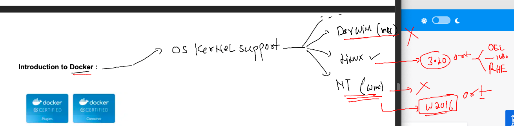

## Docker & K8s Training Plan 


### problem with bare-metal servers while deploying / testing app


### introduction to virtualization using hypervisor 


### understanding problem with VM 


## Introduction to Kernel 


### Container vs VM 


## Introduction to Docker 


### Docker support in OS kernel 



### Installing docker on ORacle LInux in OCI 

```
root@docker-ce-server ~]# yum  install docker 
Failed to set locale, defaulting to C
Loaded plugins: langpacks, ulninfo
ol7_MySQL80                                                                                 | 3.0 kB  00:00:00     
ol7_MySQL80_connectors_community                                                            | 2.9 kB  00:00:00     
ol7_MySQL80_tools_c

================================================================================================================
Install  1 Package (+7 Dependent packages)

Total download size: 87 M
Installed size: 356 M
Is this ok [y/d/N]: yy
Is this ok [y/d/N]: y
Downloading packages:
(1/8): container-selinux-2.119.2-1.911c772.el7_8.noarch.rpm                                 |  39 kB  00:00:00     
(2/8): criu-3.12-2.el7.x86_64.rpm                                                           | 452 kB  00:00:00     
(3/8): containerd-1.4.8-1.el7.x86_64.rpm                                                    |  29 MB  00:00:00     
(4/8): docker-cli-19.03.11.ol-13.el7.x86_64.rpm                                             |  33 MB  00:00:00     
(5/8): runc-1.1.3-1.el7.x86_64.rpm                                                          | 2.9 MB  00:00:00     
(6/8): docker-engine-19.03.11.ol-13.el7.x86_64.rpm                                          |  21 MB  00:00:00     
(7/8): libnet-1.1.6-7.el7.x86_64.rpm                                                        |  57 kB  00:00:00     
(8/8): protobuf-c-1.0.2-3.el7.x86_64.rpm                                                    |  27 kB  00:00:00     
-------------------------------------------------------------------------------------------------------------------
Total                                                                              144 MB/s |  87 MB  00:00:00     
Running transaction check
Running transaction test


```


### starting docker service and making it persistent 

```
[root@docker-ce-server ~]# systemctl start  docker 
[root@docker-ce-server ~]# systemctl enable   docker 
Created symlink from /etc/systemd/system/multi-user.target.wants/docker.service to /usr/lib/systemd/system/docker.service.
[root@docker-ce-server ~]# systemctl  status    docker 
● docker.service - Docker Application Container Engine
   Loaded: loaded (/usr/lib/systemd/system/docker.service; enabled; vendor preset: disabled)
   Active: active (running) since Mon 2022-11-07 05:50:27 GMT; 16s ago
     Docs: https://docs.docker.com
 Main PID: 16149 (dockerd)
   CGroup: /system.slice/docker.service
           └─16149 /usr/bin/dockerd -H fd:// --containerd=/run/containerd/containerd.sock


```

### giving docker service access to a non root user 

```
[root@docker-ce-server ~]# 
[root@docker-ce-server ~]# cat  /etc/group   |   grep -i docker 
docker:x:992:
[root@docker-ce-server ~]# 
[root@docker-ce-server ~]# usermod -aG docker  ashu
[root@docker-ce-server ~]# 
[root@docker-ce-server ~]# 
[root@docker-ce-server ~]# cat  /etc/group   |   grep -i docker 
docker:x:992:ashu
[root@docker-ce-server ~]# 


```

### lets check 

```
[ashu@docker-ce-server ~]$ docker  version 
Client: Docker Engine - Community
 Version:           19.03.11-ol
 API version:       1.40
 Go version:        go1.16.2
 Git commit:        9bb540d
 Built:             Fri Jul 23 01:33:55 2021
 OS/Arch:           linux/amd64
 Experimental:      false

Server: Docker Engine - Community
 Engine:
  Version:          19.03.11-ol
  API version:      1.40 (minimum version 1.12)
  Go version:       go1.16.2
  Git commit:       9bb540d
  Built:            Fri Jul 23 01:32:08 2021
  OS/Arch:          linux/amd64
  Experimental:     false
  Default Registry: docker.io
 containerd:
  Version:          v1.4.8

```

### Docker architecture 


### app containerization 


### images and containers 


### a docker images library -- Registry 


### pulling and searching images 

```
[ashu@docker-ce-server ~]$ docker  images
REPOSITORY          TAG                 IMAGE ID            CREATED             SIZE
[ashu@docker-ce-server ~]$ 
[ashu@docker-ce-server ~]$ 
[ashu@docker-ce-server ~]$ docker  pull  mysql
Using default tag: latest
Trying to pull repository docker.io/library/mysql ... 
latest: Pulling from docker.io/library/mysql
feec22b5b798: Pull complete 
3b33952322b1: Pull complete 
8632ee03bb1c: Pull complete 
636ccd115361: Pull complete 
b07c8fac8eea: Pull complete 
e44c54db9c14: Pull complete 
cf9c45749101: Pull complete 
9f2fa3febc47: Pull complete 
44d5e1d3c311: Pull complete 
bb3db2c5d8ec: Pull complete 
e0ead729abd9: Pull complete 
Digest: sha256:717e6f25ed8997b7ecb0408e063c4dcba202a68b341ebac4c4d97f51439b87ee
Status: Downloaded newer image for mysql:latest
mysql:latest
[ashu@docker-ce-server ~]$ docker  images
REPOSITORY          TAG                 IMAGE ID            CREATED             SIZE
mysql               latest              2a04bf34fdf0        2 days ago          535MB
[ashu@docker-ce-server ~]$ 

```

### pulled images from docker hub 

```
   16  docker  pull openjdk 
   17  docker  images
   18  docker  pull  oraclelinux:8.4 
   19  docker  pull  oraclelinux:9
   20  history 
[ashu@docker-ce-server ~]$ docker  images
REPOSITORY          TAG                 IMAGE ID            CREATED             SIZE
mysql               latest              2a04bf34fdf0        2 days ago          535MB
openjdk             latest              cf6479cba824        2 days ago          464MB
oraclelinux         9                   781047083117        2 days ago          222MB
oraclelinux         8.4                 97e22ab49eea        12 months ago       246MB
[ashu@docker-ce-server ~]$ 

```

### docker pull & tag 

```
 27  docker pull quay.io/libpod/alpine
   28  docker  images  |   grep quay
   29  docker  tag  961769676411  ashuquay:v1 
   30  docker images
   31  history 
   32  docker pull container-registry.oracle.com/java/openjdk:latest
   33  docker tag container-registry.oracle.com/java/openjdk:latest   ashuoracle:v1 
```

### lets create our first container -- container need something to run 


### creating first container 


### creating 

```
[ashu@docker-ce-server ~]$ docker  run --name ashuc1  -d   alpine   ping google.com 
1bd547d9737f668c7d2424c9a5ec33c11aff57db23a5bf05bf0c085916ee036f
[ashu@docker-ce-server ~]$ docker  ps
CONTAINER ID        IMAGE               COMMAND             CREATED             STATUS              PORTS               NAMES
2924f7f69496        alpine              "ping google.com"   5 seconds ago       Up 4 seconds                            venkatesc1
68e913bcaa5a        alpine              "ping google.com"   7 seconds ago       Up 7 seconds                            rubic1
1bd547d9737f        alpine              "ping google.com"   13 seconds ago      Up 12 seconds                           ashuc1
aba8276b8857        alpine              "ping google.com"   2 minutes ago       Up 2 minutes                            manjunathc1
[ashu@docker-ce-server ~]$ 


```


### checking output of container process 

```
  49  docker logs HKO 
   50  docker logs  ashuc1 
```
## more container operations 

### checking container resources consumption 

```
[ashu@docker-ce-server ~]$ docker  stats  ashuc1 
CONTAINER ID        NAME                CPU %               MEM USAGE / LIMIT   MEM %               NET I/O             BLOCK I/O           PIDS
1bd547d9737f        ashuc1              0.01%               292KiB / 15.35GiB   0.00%               496kB / 495kB       0B / 0B             1
^C
```

### stopping a container 

```
[ashu@docker-ce-server ~]$ docker  stop  ashuc1 
ashuc1
```

### starting a non running container 

```
[ashu@docker-ce-server ~]$ docker   start  ashuc1 
ashuc1
[ashu@docker-ce-server ~]$ docker  ps
CONTAINER ID        IMAGE               COMMAND             CREATED             STATUS              PORTS               NAMES
1bd547d9737f        alpine              "ping google.com"   About an hour ago   Up 1 second                             ashuc1
[ashu@docker-ce-server ~]$ 
```

### accessing a running container command line 

```
[ashu@docker-ce-server ~]$ docker   exec   ashuc1   whoami 
root
[ashu@docker-ce-server ~]$ whoami
ashu
[ashu@docker-ce-server ~]$ 
[ashu@docker-ce-server ~]$ docker   exec   ashuc1  cat /etc/os-release 
NAME="Alpine Linux"
ID=alpine
VERSION_ID=3.16.2
PRETTY_NAME="Alpine Linux v3.16"
HOME_URL="https://alpinelinux.org/"
BUG_REPORT_URL="https://gitlab.alpinelinux.org/alpine/aports/-/issues"
[ashu@docker-ce-server ~]$ 
```

### getting container shell

```
[ashu@docker-ce-server ~]$ docker   exec -it   ashuc1  sh 
/ # 
/ # 
/ # whoami
root
/ # cat /etc/os-release 
NAME="Alpine Linux"
ID=alpine
VERSION_ID=3.16.2
PRETTY_NAME="Alpine Linux v3.16"
HOME_URL="https://alpinelinux.org/"
BUG_REPORT_URL="https://gitlab.alpinelinux.org/alpine/aports/-/issues"
/ # ls
bin    dev    etc    home   lib    media  mnt    opt    proc   root   run    sbin   srv    sys    tmp    usr    var
/ # 
/ # exit

```

### removing a stopped container 

```
[ashu@docker-ce-server ~]$ docker  stop  ashuc1
ashuc1
[ashu@docker-ce-server ~]$ docker  rm  ashuc1 
ashuc1
```

### container life cycle 


## Day1 problem 

```
[ashu@docker-ce-server ~]$ docker  run -d --name ashuc1  alpine ping fb.com 
aed018842202ff884fcaf93ae5b76dfd1c87be883efae0a1e8d8bd2a83327740
[ashu@docker-ce-server ~]$ docker  run -d --name ashuc2  alpine ping fb.com 
112cdd2b5aebbf1092723fff111bc3f9d87ac76994339bf2b565fe5bc1982020
[ashu@docker-ce-server ~]$ 
[ashu@docker-ce-server ~]$ 
[ashu@docker-ce-server ~]$ docker  exec -it ashuc1  sh 
/ # pwd
/
/ # ls
bin    dev    etc    home   lib    media  mnt    opt    proc   root   run    sbin   srv    sys    tmp    usr    var
/ # echo hello world  >helloc1.txt 
/ # ls
bin          etc          home         media        opt          root         sbin         sys          usr
dev          helloc1.txt  lib          mnt          proc         run          srv          tmp          var
/ # cat helloc1.txt 
hello world
/ # exit
[ashu@docker-ce-server ~]$ docker  cp  ashuc1:/helloc1.txt  . 
[ashu@docker-ce-server ~]$ ls
helloc1.txt
[ashu@docker-ce-server ~]$ docker  cp helloc1.txt  ashuc2:/
[ashu@docker-ce-server ~]$ 
[ashu@docker-ce-server ~]$ docker  exec ashuc2  ls  /
bin
dev
etc
helloc1.txt
home
lib
media
mnt
opt
proc
root
run
sbin
srv
sys
tmp
usr
var
[ashu@docker-ce-server ~]$ 

```


