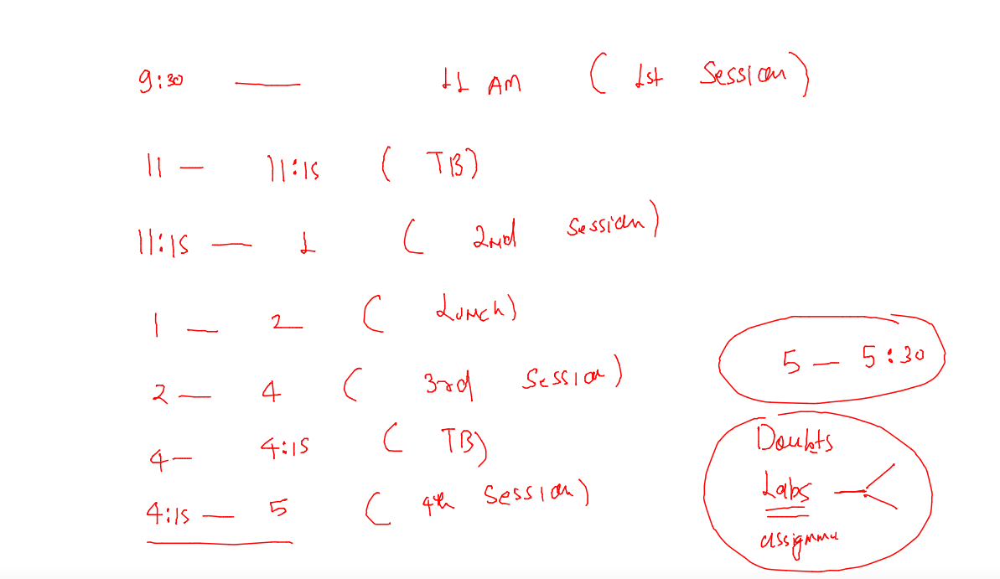

## Docker & K8s Training Plan 



### Revision 


### access docker volume from backend of docker server with root access 

```
[root@docker-ce-server ~]# cd  /var/lib/docker/
[root@docker-ce-server docker]# ls
builder  buildkit  containers  image  network  overlay2  plugins  runtimes  swarm  tmp  trust  volumes
[root@docker-ce-server docker]# cd  volumes/
[root@docker-ce-server volumes]# ls
2bcfb1cc2bf3d43eb0e6bdeb98c88f8e200229bfec5d64fe0ab51bd0fd9e5d61  gitavol10    narasimhavol9  sonvol9
821c0943f31ce6b13359ceb6fbf398f61604f06cac8f8647d44e62d9be3540a8  gitavol9     navneet-1      sonvol99
926e3be0776608b60356c316cea3a9be11dfd404a800e9646b3e6ebfc57fe913  hari_db      navneetvol9    sooryavol9
aishvol9                                                          harivo19     navneetvol99   sooryavol99
aishvol99                                                         harivo199    sbvol9         venkatvol9
e328256af4bc21885aa4246aa938bb464ddec22177d9ff2773efafc01090030a  metadata.db  sbvol99        venkatvol99
[root@docker-ce-server volumes]# cd hari_db/
[root@docker-ce-server hari_db]# ls
_data
[root@docker-ce-server hari_db]# cd _data/
[root@docker-ce-server _data]# ls
#ib_16384_0.dblwr  #innodb_temp   binlog.000002  ca.pem           hari            ibtmp1     mysql.sock          public_key.pem   sys
#ib_16384_1.dblwr  auto.cnf       binlog.index   client-cert.pem  ib_buffer_pool  mysql      performance_schema  server-cert.pem  undo_001
#innodb_redo       binlog.000001  ca-key.pem     client-key.pem   ibdata1         mysql.ibd  private_key.pem     server-key.pem   undo_002
[root@docker-ce-server _data]# 

```

### Docker volume documentation 

[volume](https://docs.docker.com/storage/volumes/)


## Webapp contiainerization 

### Dockerfile


### nginx iNfo 


### taking sample html based web app 

```
[ashu@docker-ce-server webapps]$ git clone https://github.com/schoolofdevops/html-sample-app.git
Cloning into 'html-sample-app'...
remote: Enumerating objects: 74, done.
remote: Total 74 (delta 0), reused 0 (delta 0), pack-reused 74
Unpacking objects: 100% (74/74), done.
[ashu@docker-ce-server webapps]$ ls
html-sample-app
[ashu@docker-ce-server webapps]$ 
```

### Dockerfile 

```
FROM nginx
LABEL name=ashutoshh
COPY html-sample-app /usr/share/nginx/html/
# using copy or add we can copy entire Folder data also
# Note: if we are not using CMD /ENTRYPOINT then base image CMD /entrypoint will be 
# inherited
```

### lets build image 

```
[ashu@docker-ce-server webapps]$ ls
Dockerfile  html-sample-app
[ashu@docker-ce-server webapps]$ docker build -t  ashunginx:appv1 . 
Sending build context to Docker daemon  3.744MB
Step 1/3 : FROM nginx
Trying to pull repository docker.io/library/nginx ... 
latest: Pulling from docker.io/library/nginx
e9995326b091: Pull complete 
71689475aec2: Pull complete 
f88a23025338: Pull complete 
0df440342e26: Pull complete 
eef26ceb3309: Pull complete 
8e3ed6a9e43a: Pull complete 
Digest: sha256:943c25b4b66b332184d5ba6bb18234273551593016c0e0ae906bab111548239f
Status: Downloaded newer image for nginx:latest
 ---> 76c69feac34e
Step 2/3 : LABEL name=ashutoshh
 ---> Running in 519e59b2abeb
Removing intermediate container 519e59b2abeb
 ---> d9a2ee99cb68
Step 3/3 : COPY html-sample-app /usr/share/nginx/html/
 ---> 8d86b31cd611
Successfully built 8d86b31cd611
Successfully tagged ashunginx:appv1
```

### checking image 

```
321  docker build -t  ashunginx:appv1 . 
  322  history 
[ashu@docker-ce-server webapps]$ docker images  |   grep ashu
ashunginx                               appv1               8d86b31cd611        34 seconds ago      145MB
ashustorage                             v1                  97bc1dfcde59        20 hours ago        5.54MB
dockerashu/oracleashu                   pyappv1             b866ef88a55e        23 hours ago        55.8MB
[ashu@docker-ce-server webapps]$ 
```

### creating port mapping 

```
ashu@docker-ce-server webapps]$ docker run -d --name ashuwebc1 -p 1234:80 ashunginx:appv1  
ff6b8e99a78323a48c9f55f518120cb06a30a7da01a2278c5d29bcad15ffca68
[ashu@docker-ce-server webapps]$ docker ps
CONTAINER ID        IMAGE               COMMAND                  CREATED             STATUS              PORTS                  NAMES
2d5a936b8602        gitanx:appv1        "/docker-entrypoint.…"   5 seconds ago       Up 4 seconds        0.0.0.0:1029->80/tcp   gitawebc1
ff6b8e99a783        ashunginx:appv1     "/docker-entrypoint.…"   7 seconds ago       Up 6 seconds        0.0.0.0:1234->80/tcp   ashuwebc1
```

### Cgroups in Docker 


### putting memory limit in container 

```
[ashu@docker-ce-server webapps]$ docker run -d --name ashuwebc1 -p 1234:80  --memory 2G     ashunginx:appv1  
691021eb182f11ce44c53e33c70d17d490451f2e041ea0a79a233a56976f4ece
```

### cpu shares 


## Docker compose -- to Scriptify all docker instructions

### compose info 


### installing docker-compose 

```
[root@docker-ce-server ~]# curl -SL https://github.com/docker/compose/releases/download/v2.12.2/docker-compose-linux-x86_64  -o /usr/bin/docker-compose 
  % Total    % Received % Xferd  Average Speed   Time    Time     Time  Current
                                 Dload  Upload   Total   Spent    Left  Speed
  0     0    0     0    0     0      0      0 --:--:-- --:--:-- --:--:--     0
100 42.8M  100 42.8M    0     0  7383k      0  0:00:05  0:00:05 --:--:-- 7168k
[root@docker-ce-server ~]# 
[root@docker-ce-server ~]# 
[root@docker-ce-server ~]# chmod +x /usr/bin/docker-compose 
[root@docker-ce-server ~]# docker-compose version 
Docker Compose version v2.12.2
[root@docker-ce-server ~]# 

```

### compose file example 1

```
version: '3.8' # compose file latest version 
services: # write app component 
  ashuwebapp:
    image: ashunginx:appv1 # docker image 
    container_name: ashuwebc111 # name of container 
    ports: # port mapping
    - "1234:80"
   
```

### running compose file 

```
[ashu@docker-ce-server ashuimages]$ ls
ashu-compose  java  python  storage  tasks  webapps
[ashu@docker-ce-server ashuimages]$ cd  ashu-compose/
[ashu@docker-ce-server ashu-compose]$ ls
docker-compose.yaml
[ashu@docker-ce-server ashu-compose]$ docker-compose up -d 
[+] Running 2/2
 ⠿ Network ashu-compose_default  Created                                                           0.1s
 ⠿ Container ashuwebc111         Started                                                           0.7s
[ashu@docker-ce-server ashu-compose]$ docker-compose ps
NAME                COMMAND                  SERVICE             STATUS              PORTS
ashuwebc111         "/docker-entrypoint.…"   ashuwebapp          running             0.0.0.0:1234->80/tcp
```

### more compose operations 

```
[ashu@docker-ce-server ashu-compose]$ docker-compose ps
NAME                COMMAND                  SERVICE             STATUS              PORTS
ashuwebc111         "/docker-entrypoint.…"   ashuwebapp          running             0.0.0.0:1234->80/tcp
[ashu@docker-ce-server ashu-compose]$ docker-compose  stop 
[+] Running 1/1
 ⠿ Container ashuwebc111  Stopped                                                                                             0.5s
[ashu@docker-ce-server ashu-compose]$ docker-compose ps
NAME                COMMAND                  SERVICE             STATUS              PORTS
ashuwebc111         "/docker-entrypoint.…"   ashuwebapp          exited (0)          
[ashu@docker-ce-server ashu-compose]$ docker-compose start
[+] Running 1/1
 ⠿ Container ashuwebc111  Started                                                                                             0.4s
[ashu@docker-ce-server ashu-compose]$ docker-compose ps
NAME                COMMAND                  SERVICE             STATUS              PORTS
ashuwebc111         "/docker-entrypoint.…"   ashuwebapp          running             0.0.0.0:1234->80/tcp
[ashu@docker-ce-server ashu-compose]$ 
```

### clean up 

```
[ashu@docker-ce-server ashu-compose]$ docker-compose down 
[+] Running 2/2
 ⠿ Container ashuwebc111         Removed                                                                                      0.5s
 ⠿ Network ashu-compose_default  Removed       
```


### Compose example 2

```
version: '3.8'
volumes: # to create volume
  ashudb-vol009: # name of volume 
services:
  ashuapp1:
    image: alpine
    container_name: ashuc111
    command: ping fb.com 
  ashuapp2:
    image: mysql
    container_name: ashudbc1 
    environment:
      MYSQL_ROOT_PASSWORD: "Oracle@098#"
    volumes: # attaching volume 
    - "ashudb-vol009:/var/lib/mysql/"

```

### lets run it 

```
[ashu@docker-ce-server ashu-compose]$ docker-compose down 
[ashu@docker-ce-server ashu-compose]$ ls
docker-compose.yaml  multic.yaml
[ashu@docker-ce-server ashu-compose]$ docker-compose -f multic.yaml  up  -d 
[+] Running 4/4
 ⠿ Network ashu-compose_default         Created                                                    0.1s
 ⠿ Volume "ashu-compose_ashudb-vol009"  Created                                                    0.0s
 ⠿ Container ashudbc1                   Started                                                    0.9s
 ⠿ Container ashuc111                   Started                                                    0.9s
[ashu@docker-ce-server ashu-compose]$ docker-compose -f multic.yaml ps 
NAME                COMMAND                  SERVICE             STATUS              PORTS
ashuc111            "ping fb.com"            ashuapp1            running             
ashudbc1            "docker-entrypoint.s…"   ashuapp2            running             3306/tcp, 33060/tcp
[ashu@docker-ce-server ashu-compose]$ docker-compose -f multic.yaml  down 
[+] Running 3/3
 ⠿ Container ashudbc1            Removed                                                           1.6s
 ⠿ Container ashuc111            Removed                                                          10.5s
 ⠿ Network ashu-compose_default  Removed                                                           0.1s
[ashu@docker-ce-server ashu-compose]$ 
```


