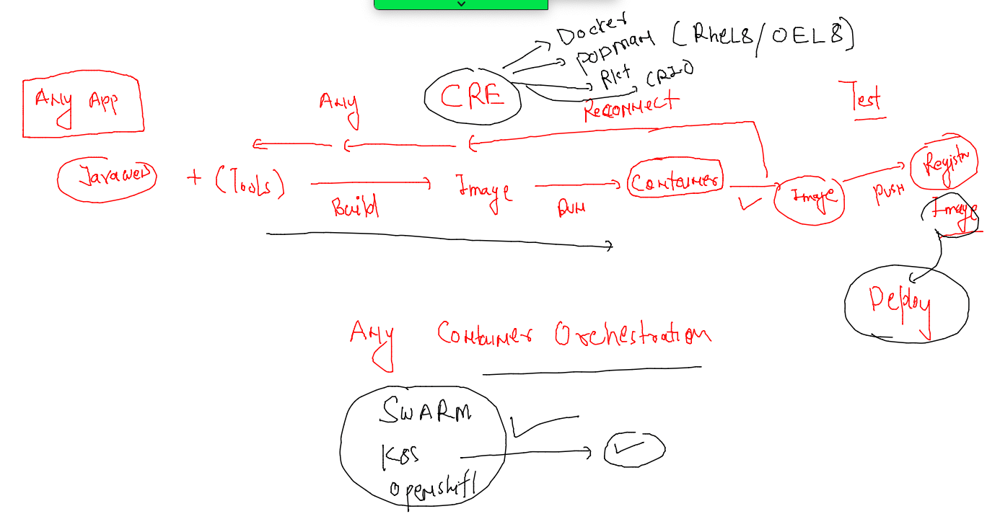

## Docker & K8s Training Plan 


### Revision 



## Understanding k8s architecture again 

### k8s client to control plane 


### checking k8s client version 

```
[ashu@docker-ce-server ashuimages]$ kubectl  version --client -o yaml 
clientVersion:
  buildDate: "2022-10-12T10:57:26Z"
  compiler: gc
  gitCommit: 434bfd82814af038ad94d62ebe59b133fcb50506
  gitTreeState: clean
  gitVersion: v1.25.3
  goVersion: go1.19.2
  major: "1"
  minor: "25"
  platform: linux/amd64
kustomizeVersion: v4.5.7
```

### auth file on master node which needs to be shared to all k8s engineers 

```
[root@masternode ~]# cd  /etc/kubernetes/
[root@masternode kubernetes]# ls
admin.conf
```

### Now sending request 

```
[ashu@docker-ce-server ashuimages]$ ls
admin.conf  ashu-compose  java  python  storage  tasks  webapps
[ashu@docker-ce-server ashuimages]$ 
[ashu@docker-ce-server ashuimages]$ kubectl   get  nodes  --kubeconfig admin.conf 
NAME         STATUS   ROLES           AGE   VERSION
masternode   Ready    control-plane   18h   v1.25.3
minion1      Ready    <none>          18h   v1.25.3
minion2      Ready    <none>          18h   v1.25.3
[ashu@docker-ce-server ashuimages]$ kubectl  version -o yaml   --kubeconfig admin.conf 
clientVersion:
  buildDate: "2022-10-12T10:57:26Z"
  compiler: gc
  gitCommit: 434bfd82814af038ad94d62ebe59b133fcb50506
  gitTreeState: clean
  gitVersion: v1.25.3
  goVersion: go1.19.2
  major: "1"
  minor: "25"
  platform: linux/amd64
kustomizeVersion: v4.5.7
serverVersion:
  buildDate: "2022-10-12T10:49:09Z"
  compiler: gc
  gitCommit: 434bfd82814af038ad94d62ebe59b133fcb50506
  gitTreeState: clean
  gitVersion: v1.25.3
  goVersion: go1.19.2
  major: "1"
  minor: "25"
  platform: linux/amd64
```

### copying  default location of kubeconf file 

```
[ashu@docker-ce-server ashuimages]$ mkdir ~/.kube 
mkdir: cannot create directory ‘/home/ashu/.kube’: File exists
[ashu@docker-ce-server ashuimages]$ 
[ashu@docker-ce-server ashuimages]$ 
[ashu@docker-ce-server ashuimages]$ cp -v admin.conf   ~/.kube/config 
‘admin.conf’ -> ‘/home/ashu/.kube/config’
[ashu@docker-ce-server ashuimages]$ 
[ashu@docker-ce-server ashuimages]$ 
[ashu@docker-ce-server ashuimages]$ 
[ashu@docker-ce-server ashuimages]$ kubectl  get nodes 
NAME         STATUS   ROLES           AGE   VERSION
masternode   Ready    control-plane   18h   v1.25.3
minion1      Ready    <none>          18h   v1.25.3
minion2      Ready    <none>          18h   v1.25.3
```

### taking javawebapp sample 

```
git clone https://github.com/redashu/javawebapp.git
  394  ls
  395  ls  javawebapp/
  396  ls
  397  mv  javawebapp/  ashujavawebapp
  398  ls
  399  ls  ashujavawebapp/
  400  history 
  401  ls
  402  cd  ashujavawebapp/
```

### adding compose file to ashujavawebapp folder 

```
version: '3.8'
services:
  ashuapp1:
    image: ashujavaweb:appv1 # image i want to build
    build: 
      context: . # location of dockerfile 
      dockerfile: Dockerfile # name of dockerfile 
    container_name: ashuc1
    ports:
    - 1234:8080 
```

### running compose 

```
[ashu@docker-ce-server ashujavawebapp]$ docker-compose up -d --build 
[+] Building 0.6s (10/10) FINISHED                                                               
 => [internal] load build definition from Dockerfile                                        0.0s
 => => transferring dockerfile: 91B                                                         0.0s
 => [internal] load .dockerignore                                                           0.0s
 => => transferring context: 2B                                                             0.0s
 => [internal] load metadata for docker.io/library/tomcat:latest                            0.6s
 => [1/5] FROM docker.io/library/tomcat@sha256:5de987eeafd1182f31af7c97580d2a2bd06a1a27996  0.0s
 => [internal] load build context                                                           0.0s
 => => transferring context: 565B                                                           0.0s
 => CACHED [2/5] WORKDIR /usr/local/tomcat/webapps                                          0.0s
 => CACHED [3/5] RUN mkdir oracle                                                           0.0s
 => CACHED [4/5] WORKDIR oracle                                                             0.0s
 => CACHED [5/5] ADD myapp .                                                                0.0s
 => exporting to image                                                                      0.0s
 => => exporting layers                                                                     0.0s
 => => writing image sha256:5d14c38ccc4e6201b08448ce7b7738cc286eba0abdb0c8e6cd5249de1de144  0.0s
 => => naming to docker.io/library/ashujavaweb:appv1                                        0.0s
[+] Running 1/0
 ⠿ Container ashuc1  Running                                                                0.0s
[ashu@docker-ce-server ashujavawebapp]$ docker-compose  ps
NAME                COMMAND             SERVICE             STATUS              PORTS
ashuc1              "catalina.sh run"   ashuapp1            running             0.0.0.0:1234->8080/tcp
```


